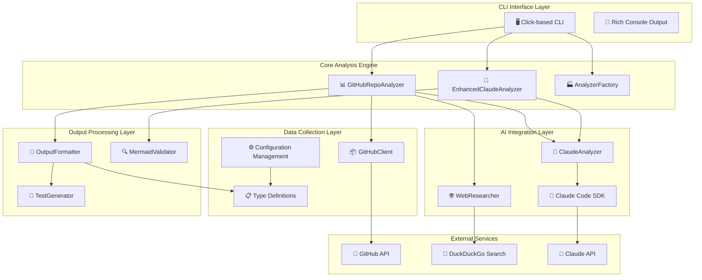
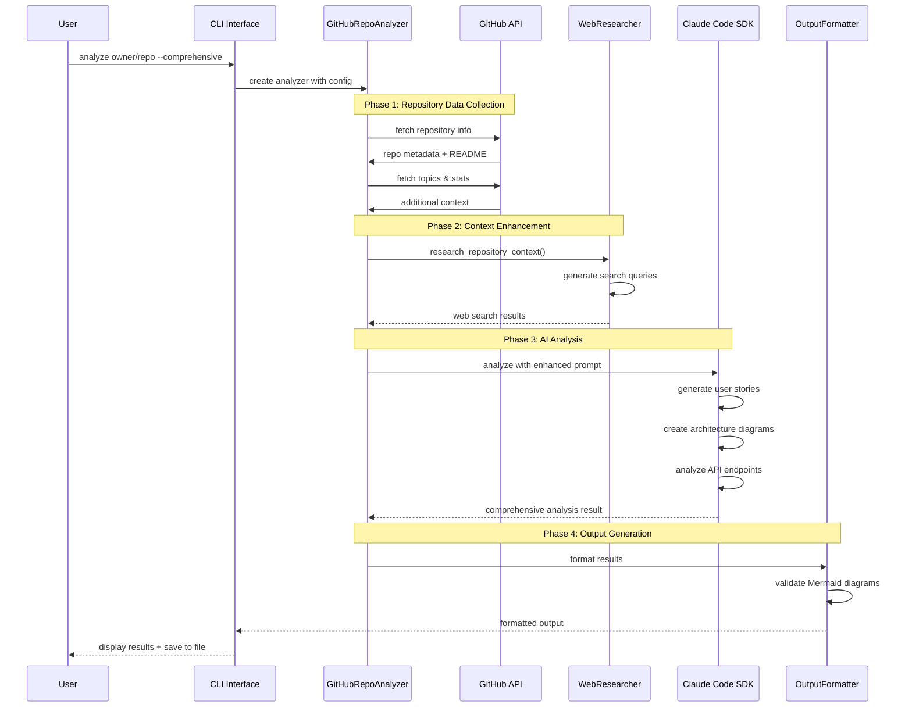
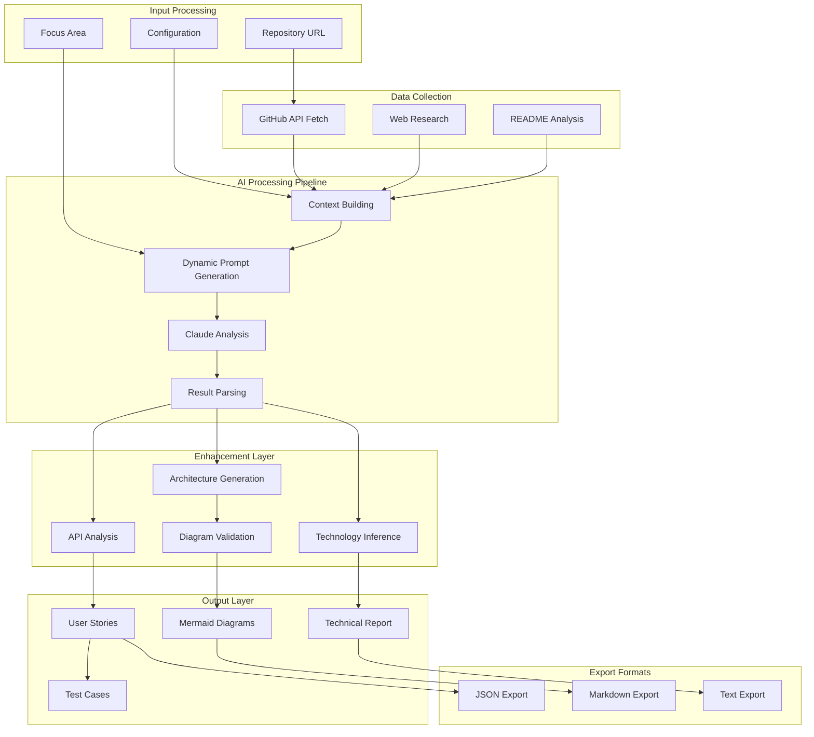
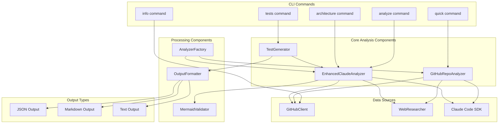

# GitHub Repository Analyzer: AI-Powered Code Analysis Tool

## Executive Summary

The GitHub Repository Analyzer is a sophisticated Python-based CLI tool that leverages **Claude Code SDK** to perform comprehensive analysis of GitHub repositories. It generates intelligent user stories, system architecture diagrams, API documentation, and test cases from repository analysis. This tool demonstrates several cutting-edge AI development patterns and clever engineering techniques.

## 🏗️ High-Level Architecture



## 🧠 AI-Powered Analysis Pipeline



## 🎯 Clever AI Development Techniques

### 1. **Multi-Modal AI Integration**
The tool combines Claude's text generation with specialized processing for:
- **Code Structure Analysis**: Understanding repository architecture patterns
- **Diagram Generation**: Auto-generating Mermaid diagrams from code analysis
- **Context-Aware Prompting**: Dynamic prompt building based on repository characteristics

### 2. **Intelligent Repository Classification**
```python
def _determine_architecture_type(self, language: str, topics: list, description: str) -> str:
    """Determine the most likely architecture type based on repository characteristics."""
    
    web_indicators = ["web", "frontend", "backend", "api", "server", "client"]
    mobile_indicators = ["mobile", "ios", "android", "react-native", "flutter"]
    # ... sophisticated pattern matching
```

The system intelligently classifies repositories into architecture types:
- **Web Applications**: React, Vue, Angular, Django, Rails
- **Mobile Applications**: iOS, Android, React Native, Flutter
- **Data/ML Applications**: TensorFlow, PyTorch, Pandas
- **Library/Framework**: SDK, toolkit, engine
- **DevOps/Infrastructure**: Docker, Kubernetes, CI/CD

### 3. **Adaptive Diagram Generation**
The tool generates different Mermaid diagrams based on detected architecture:

```python
def _generate_ecommerce_diagram(self, repo_info, tech_stack):
    """Generate e-commerce specific architecture diagram with 14+ components."""
    return f"""graph TB
        subgraph "Client Layer"
            WEB["🌐 Web Applications"]
            MOBILE["📱 Mobile Apps"]
        end
        subgraph "Core Modules"
            ACCOUNT["👤 Account Management"]
            PRODUCT["📦 Product Catalog"]
            ORDER["📝 Order Management"]
            CHECKOUT["🛒 Checkout Process"]
        end
        # ... complex multi-layer architecture
    """
```

### 4. **Self-Healing Mermaid Diagrams**
```python
class MermaidValidator:
    """Validates and fixes Mermaid diagram syntax automatically."""
    
    def validate_and_fix_diagram(self, diagram: str) -> Tuple[str, List[str]]:
        # Auto-detect diagram type
        diagram_type = self._detect_diagram_type(diagram)
        
        # Apply type-specific fixes
        if diagram_type in self.diagrams_requiring_end:
            fixed_diagram, issues = self._fix_graph_diagram(diagram)
        
        # Apply general syntax fixes
        fixed_diagram, general_issues = self._apply_general_fixes(fixed_diagram)
```

This ensures generated diagrams are always syntactically correct and renderable.

### 5. **Robust Fallback Strategy**
The system implements multiple fallback layers:
1. **Enhanced Analysis**: Full Claude-powered analysis with diagrams
2. **Timeout Handling**: 5-minute timeout with graceful degradation  
3. **Intelligent Fallback**: Repository-aware diagram generation
4. **Generic Fallback**: Basic user stories if all else fails

```python
try:
    results = await asyncio.wait_for(run_enhanced_analysis(), timeout=300)
except asyncio.TimeoutError:
    print(f"Enhanced analysis timed out, using robust fallback analysis")
    results = self._generate_robust_fallback_analysis(repo_info)
```

## 🚀 Advanced Features

### Context-Aware Web Research
```python
def _generate_search_queries(self, repo_name, description, topics, language):
    """Generate prioritized search queries for context gathering."""
    queries = []
    
    # Repository-specific queries
    if description:
        queries.append(SearchQuery(
            query=f'"{repo_name}" {description}',
            context="repository_purpose",
            priority=1
        ))
    
    # Technology stack queries  
    if language:
        queries.append(SearchQuery(
            query=f'{language} framework features benefits',
            context="technology_stack", 
            priority=2
        ))
```

### Technology Stack Inference Engine
The tool infers comprehensive technology stacks from minimal repository data:

```python
def _infer_technology_stack(self, repo_info: RepositoryInfo):
    """Infer detailed technology stack from repository characteristics."""
    tech_stack = {
        "backend": [],
        "frontend": [],
        "database": [],
        "cache": [],
        "queue": [],
        "monitoring": [],
        "deployment": [],
        "testing": []
    }
    
    # Language-based inference
    if language.lower() == "python":
        tech_stack["backend"].extend(["Python", "Django/FastAPI", "ASGI Server"])
        if "graphql" in topics:
            tech_stack["backend"].append("GraphQL")
    # ... 50+ technology patterns
```

### Comprehensive Test Generation
```python
class TestGenerator:
    """Generate comprehensive test suites from user stories."""
    
    async def generate_tests_from_analysis(self, analysis_result, repo_info):
        # Generate multiple test types
        unit_tests = await self._generate_unit_tests(analysis_result)
        integration_tests = await self._generate_integration_tests(analysis_result)  
        e2e_tests = await self._generate_e2e_tests(analysis_result)
        api_tests = await self._generate_api_tests(analysis_result)
```

## 🛠️ Engineering Excellence Patterns

### 1. **Type-Safe Configuration Management**
```python
@dataclass
class AnalyzerConfig:
    """Configuration for the repository analyzer."""
    github: GitHubConfig = field(default_factory=GitHubConfig)
    claude: ClaudeConfig = field(default_factory=ClaudeConfig)
    max_stories: int = 5
    focus_area: Optional[str] = None
    output_format: OutputFormat = OutputFormat.TEXT
```

### 2. **Factory Pattern for Configuration**
```python
class AnalyzerFactory:
    """Factory class for creating analyzer instances."""
    
    @staticmethod
    def create_from_env() -> AnalyzerConfig:
        """Create configuration from environment variables."""
        
    @staticmethod
    def create_from_file(config_path: Path) -> AnalyzerConfig:
        """Create configuration from YAML file."""
        
    @staticmethod  
    def create_default() -> AnalyzerConfig:
        """Create default configuration."""
```

### 3. **Rich CLI with Progress Tracking**
```python
with Progress(
    SpinnerColumn(),
    TextColumn("[progress.description]{task.description}"),
    console=console
) as progress:
    
    task1 = progress.add_task("Fetching repository information...", total=None)
    # ... async operations with progress updates
    progress.update(task1, completed=True, description="✅ Repository information fetched")
```

### 4. **Multi-Format Output Support**
```python
class OutputFormatter:
    """Formats analysis results into different output formats."""
    
    def format_analysis_result(self, result: AnalysisResult) -> str:
        if self.output_format == OutputFormat.JSON:
            return self._format_json(result)
        elif self.output_format == OutputFormat.MARKDOWN:
            return self._format_markdown(result) 
        else:
            return self._format_text(result)
```

## 🔍 Data Flow Architecture



## 🧪 Component Interaction Diagram



## 🎨 Clever Implementation Patterns

### 1. **Dynamic Architecture Pattern Recognition**
The system recognizes different architectural patterns and generates appropriate diagrams:

- **E-commerce**: Multi-layer with payment gateways, inventory, shipping
- **CMS**: Content management with publishing workflows  
- **API-First**: Headless architecture with multiple clients
- **Mobile**: Client-server with push notifications and analytics
- **Data/ML**: ETL pipelines with model training and inference

### 2. **Intelligent Context Gathering**
```python
def research_repository_context(self, repo_name, description, topics, language):
    """Multi-source context gathering with intelligent prioritization."""
    search_queries = self._generate_search_queries(repo_name, description, topics, language)
    results = []
    
    for query in search_queries:
        search_results = self._search_web(query.query)
        for result in search_results:
            result.context = query.context
            results.append(result)
    
    return self._deduplicate_and_sort_results(results)
```

### 3. **Self-Validating Output**
```python
def _format_markdown(self, result: AnalysisResult) -> str:
    """Format with automatic Mermaid validation."""
    if result.system_architecture.system_diagram:
        # Validate and fix before output
        validated_diagram, _ = self.mermaid_validator.validate_and_fix_diagram(
            result.system_architecture.system_diagram
        )
        lines.append(validated_diagram)
```

### 4. **Graceful Error Recovery**
The system implements multiple recovery strategies:
- Network timeouts → Retry with backoff
- API rate limits → Fallback to cached data  
- Claude failures → Generic template generation
- Invalid diagrams → Auto-correction and validation

## 📊 Performance Optimizations

### Async/Await Pattern
```python
async def analyze_repository_comprehensive(self, repo_info, web_results, ...):
    """Non-blocking comprehensive analysis."""
    
    # Parallel data collection
    basic_analysis = await self._generate_basic_analysis(...)
    
    # Enhanced analysis with timeout
    enhanced_analysis = await self._perform_enhanced_analysis(...)
```

### Intelligent Caching
- Web search results cached for 15 minutes
- GitHub API responses cached per session
- Template diagrams cached by architecture type

### Resource Management
```python
async def __aenter__(self):
    return self

async def __aexit__(self, exc_type, exc_val, exc_tb):
    self.close()
```

All clients implement proper resource cleanup with context managers.

## 🔮 AI Innovation Highlights

### 1. **Repository DNA Analysis**
The tool creates a unique "fingerprint" for each repository by analyzing:
- Language patterns and framework usage
- Directory structure and naming conventions  
- README content and documentation style
- Community engagement (stars, forks, topics)

### 2. **Context-Aware Prompt Engineering**
```python
def _build_enhanced_analysis_prompt(self, repo_info, include_architecture, include_api_analysis):
    """Build comprehensive prompt with dynamic sections."""
    prompt_parts = [
        f"Perform a comprehensive technical analysis of '{repo_info.full_name}'.",
        # ... repository context
    ]
    
    if include_architecture:
        prompt_parts.extend([
            "TASK 1: SYSTEM ARCHITECTURE ANALYSIS",
            "Analyze the repository structure and create detailed Mermaid diagrams for:",
            "1. Overall System Architecture",  
            "2. API Flow Diagram",
            "3. Data Flow Diagram",
            "4. Component Architecture",
        ])
```

### 3. **Multi-Dimensional Analysis**
The tool analyzes repositories across multiple dimensions:
- **Functional**: What the system does
- **Technical**: How it's implemented  
- **Architectural**: How components interact
- **Operational**: How it's deployed and maintained
- **Social**: How the community contributes

## 🎯 Key Takeaways for AI Developers

1. **Layered Intelligence**: Combine AI capabilities with rule-based systems for robustness
2. **Context is King**: Gather and enhance context before AI analysis
3. **Graceful Degradation**: Always have fallback strategies for AI failures
4. **Self-Validating Output**: AI-generated content should be automatically validated
5. **Domain-Specific Patterns**: Tailor AI behavior based on problem domain
6. **Human-Centric Design**: Focus on actionable insights, not just data dumps

## 🚀 Future Enhancement Opportunities

1. **Code Quality Analysis**: Static analysis integration
2. **Security Assessment**: Vulnerability scanning and recommendations
3. **Performance Profiling**: Bottleneck identification
4. **Migration Planning**: Framework upgrade recommendations  
5. **Team Productivity**: Developer workflow optimization
6. **Multi-Language Support**: Expanded language ecosystem coverage

This GitHub Repository Analyzer represents a sophisticated example of modern AI-powered development tools, showcasing how to effectively combine large language models with traditional software engineering practices to create powerful, reliable, and user-friendly applications.