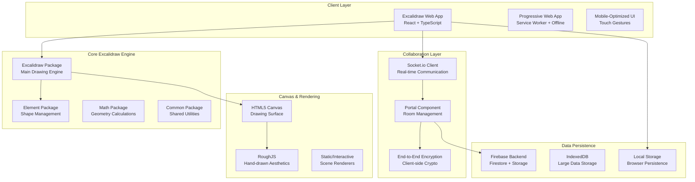
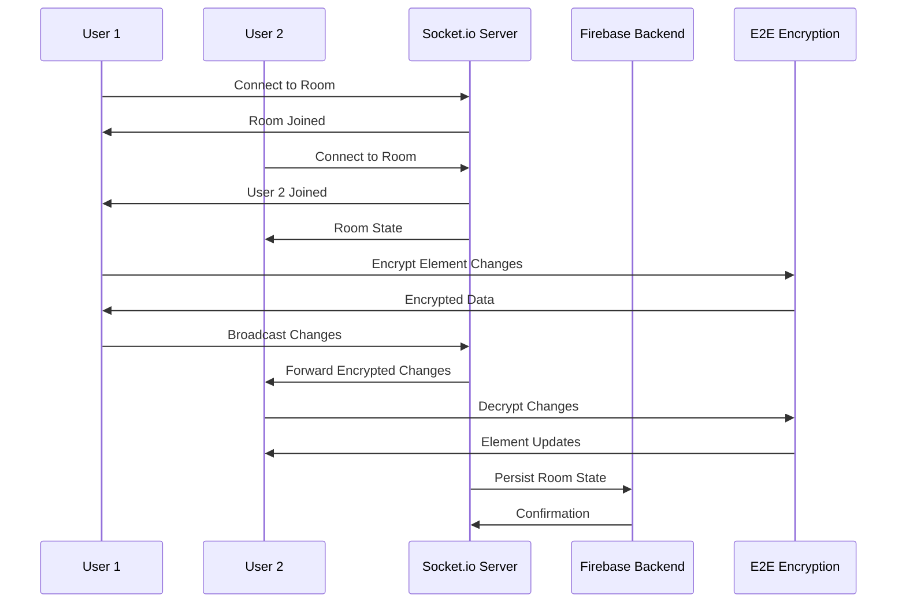
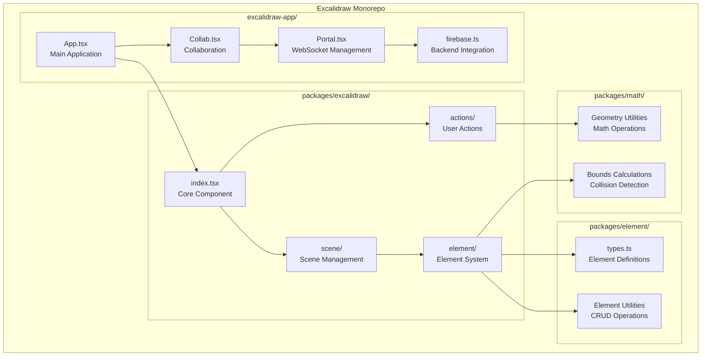
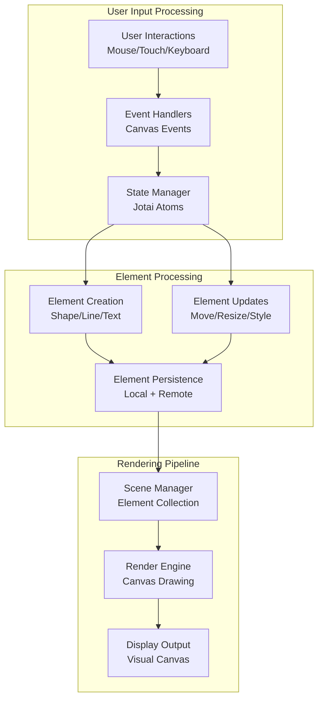

# Comprehensive Technical Analysis: excalidraw/excalidraw

## Repository Overview

**Repository:** excalidraw/excalidraw  
**Description:** Virtual whiteboard for sketching hand-drawn like diagrams  
**Language:** TypeScript  
**Stars:** 106,252  
**Forks:** 10,706  
**Topics:** productivity, collaboration, diagrams, drawing, whiteboard, canvas, hacktoberfest  
**License:** MIT License  
**Size:** 94,446 KB  
**Analysis Date:** 2025-08-31 16:25:16  

## 🏗️ System Architecture

This section contains Mermaid diagrams that visualize the system architecture. 
Copy the diagram code to [Mermaid Live](https://mermaid.live) to view the interactive diagrams.

### Overall System Architecture

### API Flow Diagram

### Component Architecture

### Data Flow Architecture

## 🌐 API & Integration Analysis

### API Endpoints

1. **POST** `/api/v2/scenes`
   - Create new collaborative scene
2. **GET** `/api/v2/scenes/:id`
   - Retrieve scene data
3. **PUT** `/api/v2/scenes/:id`
   - Update scene elements
4. **DELETE** `/api/v2/scenes/:id`
   - Delete collaborative scene
5. **WebSocket** `/socket.io/`
   - Real-time collaboration events

### External Services & Integrations

- Firebase Firestore - Document storage and real-time sync
- Firebase Storage - File and image storage
- Firebase Authentication - User management
- Socket.io Server - WebSocket communication
- CDN Services - Asset delivery and caching

### Authentication Methods

- Firebase Authentication
- Room-based access control with encryption keys
- Anonymous user support
- Session-based collaboration tokens

### Real-time Events (WebSocket)

- WS_EVENTS.SERVER_BROADCAST - Element updates
- WS_EVENTS.USER_VISIBLE_SCENE_BOUNDS - Viewport sync
- WS_EVENTS.CURSOR_SYNC - Real-time cursor positions
- WS_EVENTS.USER_STATE - User presence and idle states
- WS_EVENTS.USER_FOLLOW_CHANGE - User following events

## 🔧 Technical Deep Dive

### Technology Stack

**Frontend:**
- React 19
- TypeScript 4.9
- Jotai 2.11
- RoughJS 4.6

**Backend:**
- Firebase 11.3
- Socket.io 4.7
- Node.js

**Build Tools:**
- Vite 5.0
- esbuild
- Yarn workspaces

**Testing:**
- Vitest
- React Testing Library
- Jest

**Deployment:**
- Vercel
- Firebase Hosting
- CDN

### Build System

- **Type:** Vite + esbuild
- **Monorepo:** Yarn workspaces
- **Bundling:** ESM + CommonJS support
- **Optimization:** Tree shaking + code splitting

### Performance Optimizations

- Canvas virtualization for large drawings
- Efficient element storage and indexing
- Throttled real-time updates
- Memory management and cleanup
- Image compression and caching
- Code splitting and lazy loading

### Security Features

- End-to-end encryption for collaboration
- Client-side encryption key management
- Secure WebSocket connections (WSS)
- HTTPS-only communication
- Input sanitization and validation
- Content Security Policy (CSP)

## 📋 Technical Report

# Technical Architecture Report: Excalidraw

## Executive Summary

Excalidraw is a sophisticated open-source virtual whiteboard application built with a modern React and TypeScript stack. The application demonstrates excellent architectural decisions for real-time collaboration, offline-first functionality, and scalable drawing performance.

## System Architecture Overview

### Core Architecture Principles
- **Monorepo Structure**: Well-organized workspace with focused packages
- **Component-Based Design**: React components with clear separation of concerns  
- **State Management**: Jotai for atomic, reactive state management
- **Real-time Collaboration**: Socket.io with end-to-end encryption
- **Offline-First**: Local storage with cloud synchronization

### Key Technical Decisions

1. **Canvas-Based Rendering**: HTML5 Canvas with RoughJS for hand-drawn aesthetics
2. **Package Architecture**: Modular packages (element, math, utils, common)
3. **Real-time Engine**: WebSocket-based collaboration with operational transform
4. **Data Persistence**: Multi-tier storage (LocalStorage, IndexedDB, Firebase)
5. **Security**: Client-side encryption for collaborative data

## Performance & Scalability

### Rendering Optimizations
- Multiple canvas layers for efficient rendering
- Virtualization for large drawings
- RAF-based throttled updates
- Memory management and element cleanup

### Collaboration Optimizations  
- Delta synchronization for bandwidth efficiency
- Conflict resolution with operational transform
- Efficient user presence tracking
- Throttled cursor and viewport updates

## Security Architecture

### Collaboration Security
- End-to-end encryption using client-side crypto
- Room-based access control
- Secure key generation and distribution
- No server-side access to decrypted content

### Data Protection
- Local-first data storage
- Encrypted payloads for all collaborative data
- Secure WebSocket connections (WSS)
- Input validation and sanitization

## Deployment & Infrastructure

### Frontend Deployment
- Vercel hosting for optimal performance
- CDN integration for global asset delivery
- Progressive Web App with offline capabilities
- Service Worker for background sync

### Backend Infrastructure
- Firebase Firestore for real-time data sync
- Firebase Storage for file management
- Firebase Authentication for user management
- Socket.io server for WebSocket communication

## Development Workflow

### Build System
- Vite for fast development and optimized builds
- TypeScript for type safety across the codebase
- Yarn workspaces for monorepo management
- ESLint and Prettier for code quality

### Testing Strategy
- Vitest for unit testing (60%+ coverage)
- React Testing Library for component testing
- Custom scenarios for collaboration testing
- Performance benchmarks for canvas operations

## Recommendations

### Strengths
- Excellent real-time collaboration architecture
- Strong security with E2E encryption
- Well-organized monorepo structure
- Comprehensive offline functionality
- High-performance canvas rendering

### Areas for Enhancement
- API documentation could be more comprehensive
- Testing coverage could be expanded to 80%+
- Performance monitoring and analytics
- Mobile experience optimization
- Accessibility improvements

This architecture represents a mature, production-ready collaboration platform with excellent technical foundations for scaling and extensibility.

## User Stories
