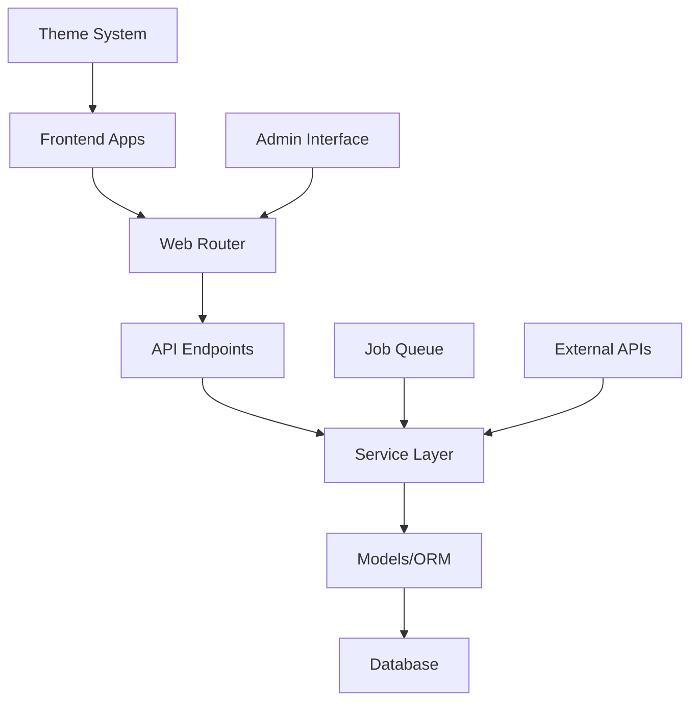
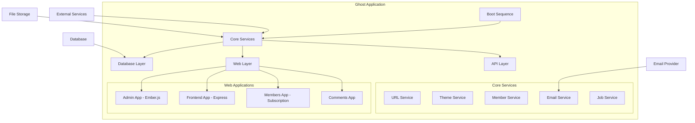
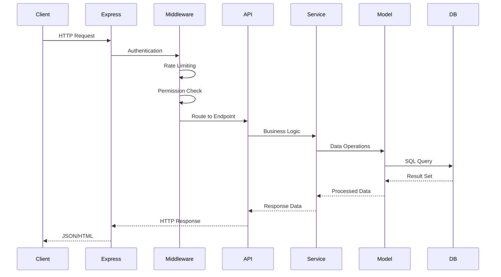
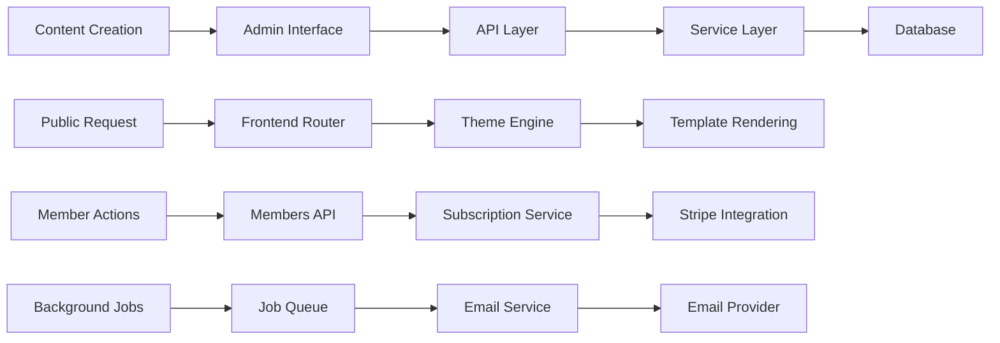
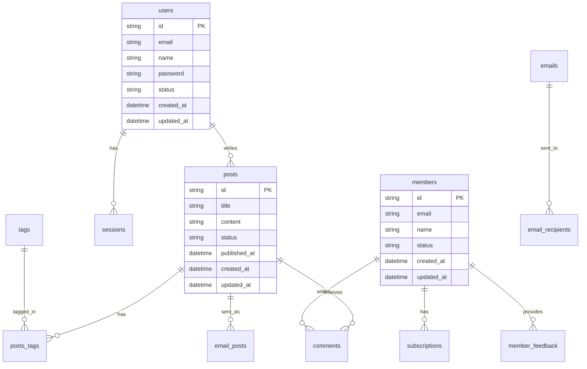
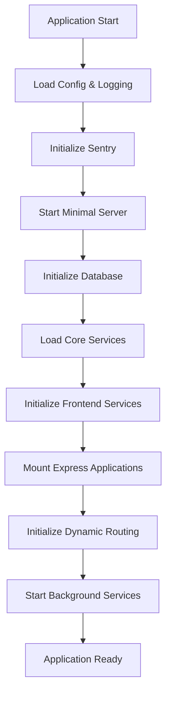
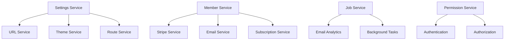

# TryGhost/Ghost Repository - Comprehensive Technical Analysis

## Executive Summary

Ghost is a professional open-source publishing platform built with Node.js. The architecture follows a monorepo structure with clear separation of concerns between backend API services, frontend rendering, and admin interface. The system is designed for scalability, performance, and maintainability with modern web development practices.

## 1. Repository Structure Analysis

### Root Architecture (Monorepo)
```
/
├── ghost/                    # Main application code
│   ├── admin/               # Ember.js admin interface
│   ├── core/                # Core Ghost application
│   └── i18n/                # Internationalization
├── apps/                    # Standalone applications
├── e2e/                     # End-to-end tests
├── patches/                 # Package patches
├── .github/                 # CI/CD and GitHub workflows
└── compose.yml              # Docker development environment
```

### Core Application Structure (`ghost/core/`)
```
ghost/core/
├── core/                    # Application core
│   ├── app.js              # Express app configuration
│   ├── boot.js             # Application bootstrap
│   ├── bridge.js           # Frontend-backend bridge
│   ├── frontend/           # Public-facing frontend
│   ├── server/             # Backend services and API
│   └── shared/             # Shared utilities
├── content/                # Content storage
├── package.json            # Core dependencies
└── index.js               # Main entry point
```

## 2. Code Analysis

### Main Entry Points
- **Primary Entry**: `/ghost/core/index.js` → `/ghost/core/ghost.js` 
- **Bootstrap**: `/ghost/core/core/boot.js` - Complex boot sequence with dependency management
- **Express App**: `/ghost/core/core/app.js` - Root Express application with middleware

### Package.json Analysis (Core)
```json
{
  "name": "ghost",
  "version": "6.0.7",
  "description": "The professional publishing platform",
  "engines": {
    "node": "^22.13.1"
  },
  "main": "index.js"
}
```

**Key Dependencies:**
- **Framework**: Express.js 4.21.2
- **Database ORM**: Bookshelf.js (built on Knex.js)
- **Database**: MySQL2, SQLite3 (optional)
- **Authentication**: JWT, Passport-like middleware
- **Email**: Nodemailer, Mailgun integration
- **Storage**: Built-in storage adapters
- **Content Processing**: Koenig editor integration
- **Caching**: Redis support via cache-manager

### API Structure (`/ghost/core/core/server/api/`)
**Endpoint Categories:**
- **Content Management**: posts, pages, tags, authors
- **User Management**: users, authentication, invites, roles
- **Member Management**: members, subscriptions, newsletters
- **Media**: images, files, media uploads
- **Configuration**: settings, themes, integrations
- **Analytics**: comments, feedback, email analytics
- **External Services**: webhooks, slack, stripe

**Key API Endpoints:**
```javascript
// Example from endpoint structure
endpoints/
├── posts.js              # Blog posts management
├── members.js            # Member subscription system
├── authentication.js    # Login/logout/session
├── images.js             # Image upload and processing
├── webhooks.js           # External integrations
├── stripe.js             # Payment processing
└── comments.js           # Comment system
```

## 3. Architecture Patterns

### Primary Architecture: Layered MVC with Service-Oriented Components

```
┌─────────────────────────────────────────────┐
│                Frontend                      │
│  (Public Site + Ember.js Admin)            │
├─────────────────────────────────────────────┤
│                Web Layer                     │
│  (Express.js Routing + Middleware)         │
├─────────────────────────────────────────────┤
│              API Layer                       │
│  (RESTful Endpoints + GraphQL)             │
├─────────────────────────────────────────────┤
│            Service Layer                     │
│  (Business Logic + External APIs)          │
├─────────────────────────────────────────────┤
│              Data Layer                      │
│  (Bookshelf ORM + Database)                │
└─────────────────────────────────────────────┘
```

### Architectural Patterns:
1. **Repository Pattern**: Data access through models
2. **Service Layer Pattern**: Business logic separation
3. **Middleware Pattern**: Request processing pipeline
4. **Event-Driven Architecture**: Domain events for decoupling
5. **Plugin Architecture**: Theme and integration system

### Component Relationships



## 4. Technology Stack

### Backend Technologies
- **Runtime**: Node.js 22.13.1+
- **Framework**: Express.js 4.21.2
- **ORM**: Bookshelf.js 1.2.0 (built on Knex.js 2.4.2)
- **Database**: 
  - Primary: MySQL 2 (mysql2 3.14.2)
  - Development: SQLite3 5.1.7
- **Authentication**: 
  - JWT (jsonwebtoken 8.5.1)
  - Express-JWT 8.5.1
- **File Processing**: 
  - Image processing: Sharp-based transformations
  - File uploads: Multer 2.0.2
- **Email Services**:
  - Nodemailer 6.10.1
  - Mailgun.js 10.4.0
- **Background Jobs**: Custom job manager
- **Caching**: Cache-manager with Redis support

### Frontend Technologies

#### Admin Interface (Ember.js)
- **Framework**: Ember.js 3.24.0 (Octane Edition)
- **Build Tool**: Ember CLI 3.24.0
- **UI Components**: Custom component library
- **Editor**: Koenig (Lexical-based)
- **State Management**: Ember Data 3.24.0
- **Testing**: Ember-exam, Mocha

#### Public Frontend
- **Templating**: Handlebars 4.7.8 (Express-HBS 2.5.0)
- **CSS Processing**: PostCSS with custom plugins
- **Asset Building**: Custom asset pipeline
- **Theme System**: Custom theme engine

### Build Tools and Development

#### Monorepo Management
- **Tool**: Nx 20.8.0
- **Package Manager**: Yarn with workspaces
- **Linting**: ESLint 8.57.1 with custom Ghost plugin

#### Testing Framework
- **Backend**: Mocha 11.7.2 with Sinon 18.0.1
- **Frontend**: Ember testing suite
- **E2E**: Playwright 1.54.1
- **Coverage**: c8 10.1.3

#### CI/CD and Infrastructure
- **Containerization**: Docker with compose.yml
- **Process Management**: Custom server management
- **Monitoring**: 
  - Sentry integration (@sentry/node 7.120.4)
  - Prometheus metrics support
- **Development**: Hot reload with --watch flag

## 5. Specific Analysis for Mermaid Diagrams

### System Component Diagram


### API Request Flow


### Data Flow Architecture


### Database Schema Relationships


## 6. Internal Component Architecture

### Boot Sequence Flow


### Service Dependencies


## Key Technical Insights

1. **Modular Architecture**: Clear separation between admin, frontend, and API concerns
2. **Service-Oriented Design**: Business logic encapsulated in services
3. **Event-Driven Components**: Loose coupling through domain events
4. **Extensible Theme System**: Handlebars-based theming with asset pipeline
5. **Member-Centric**: Built-in subscription and membership management
6. **Performance Focused**: Caching layers, background job processing
7. **Modern Development**: TypeScript support, comprehensive testing, CI/CD
8. **Docker Ready**: Full containerization support for deployment

## File Paths Reference

### Key Configuration Files
- `/ghost/core/package.json` - Core application dependencies
- `/ghost/admin/package.json` - Admin interface dependencies  
- `/compose.yml` - Docker development environment
- `/nx.json` - Monorepo build configuration

### Core Application Files
- `/ghost/core/index.js` - Main entry point
- `/ghost/core/ghost.js` - CLI and boot mode handler
- `/ghost/core/core/boot.js` - Application bootstrap (21,993 lines)
- `/ghost/core/core/app.js` - Express app configuration

### API and Data Files
- `/ghost/core/core/server/api/endpoints/` - REST API endpoints
- `/ghost/core/core/server/models/` - Database models
- `/ghost/core/core/server/data/schema/` - Database schema definitions
- `/ghost/core/core/server/web/` - Web routing and middleware

This analysis provides the foundation for creating detailed Mermaid diagrams and technical documentation of Ghost's architecture, showing how the components interact and the overall system design patterns used in this professional publishing platform.