# Saleor E-commerce Platform - Comprehensive Architecture Review

## Overview

Saleor is a modern, headless e-commerce platform built with Python and Django, featuring a GraphQL-first API architecture. It follows a composable, technology-agnostic design that enables flexible integrations and customizations.

### Key Characteristics
- **Headless Architecture**: API-only backend with decoupled frontend
- **GraphQL-Native**: Complete GraphQL API with comprehensive schema
- **Multi-tenant**: Channel-based commerce supporting multiple storefronts
- **Extensible**: Plugin system for third-party integrations
- **Open Source**: BSD-3-Clause licensed

## Technology Stack

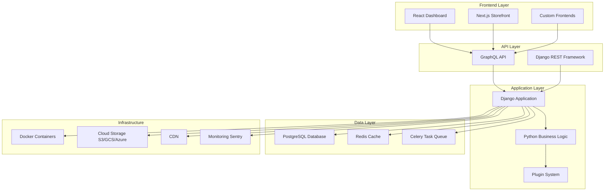

## System Architecture

### High-Level Architecture

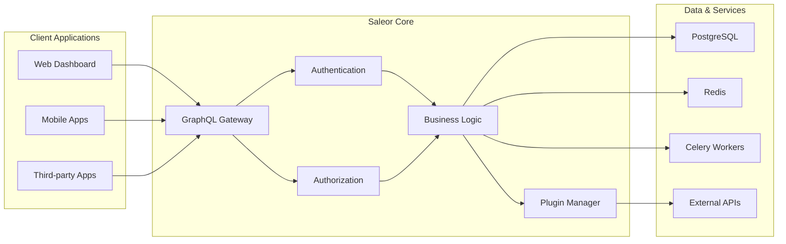

### Core Module Structure

The Saleor application is organized into domain-specific modules:

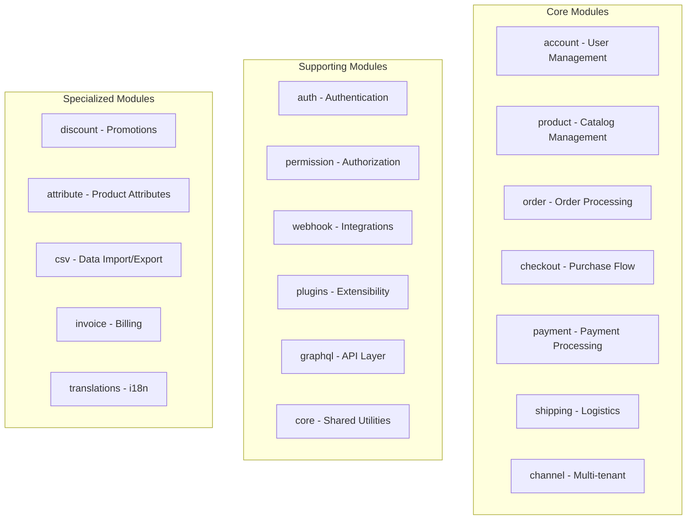

## Data Architecture

### Core Entity Relationships

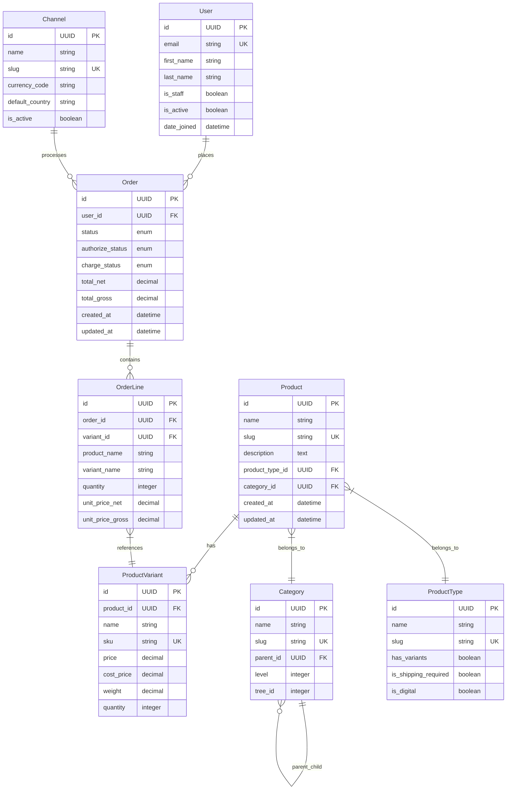

### Product Data Model

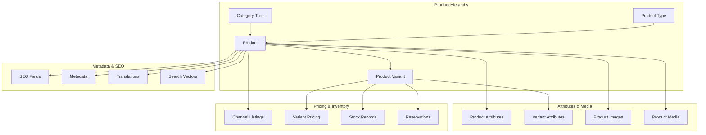

## GraphQL API Architecture

### API Structure

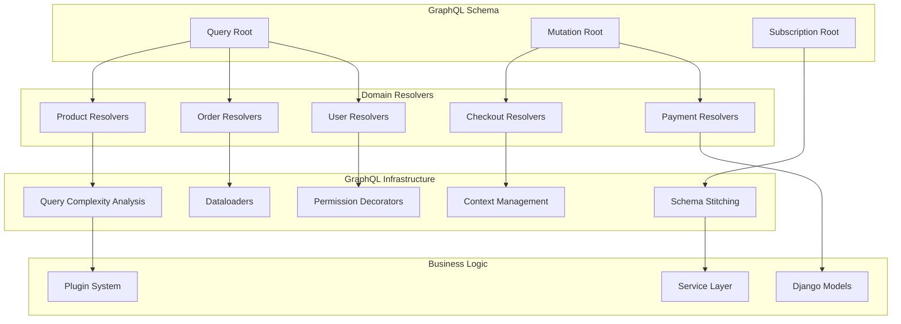

### Request Flow

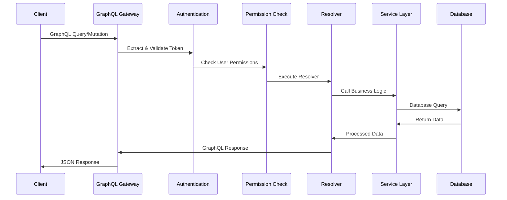

## Authentication & Authorization

### Security Architecture

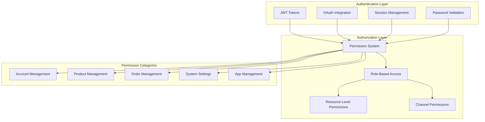

### User Management Flow

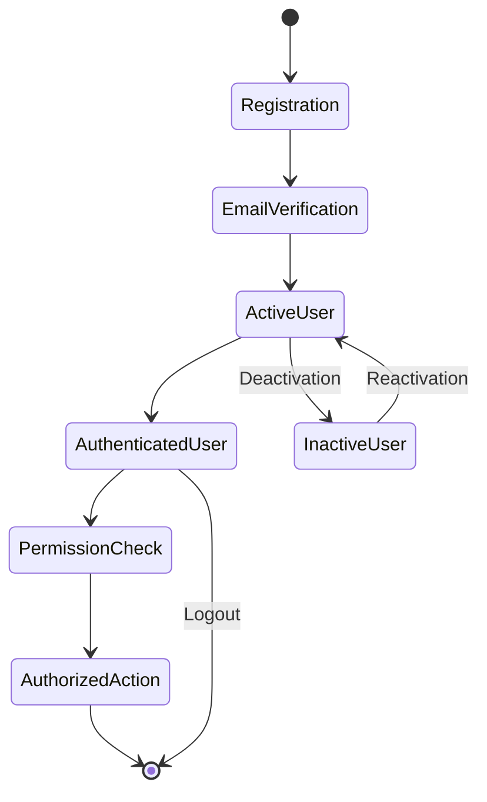

## Order Management System

### Order Lifecycle

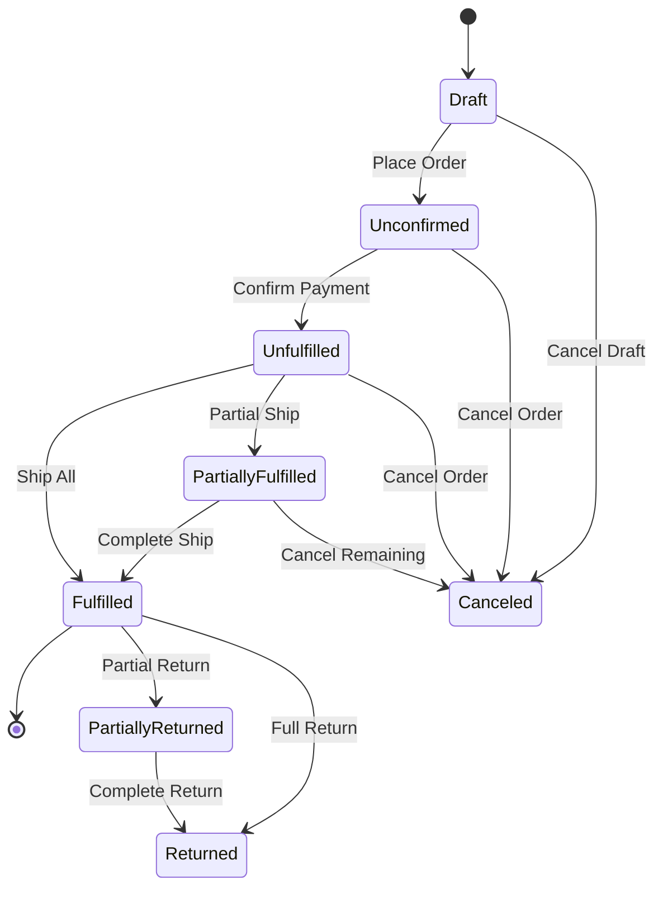

### Order Processing Flow

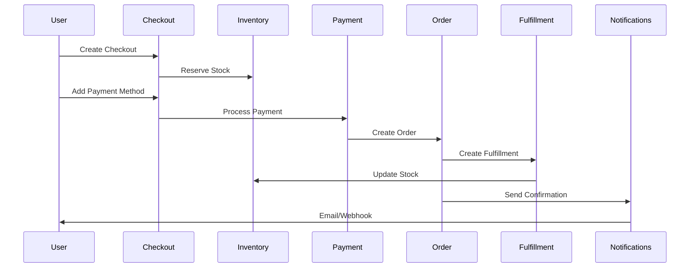

## Plugin System Architecture

### Plugin Framework

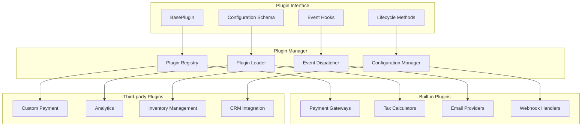

### Plugin Event System

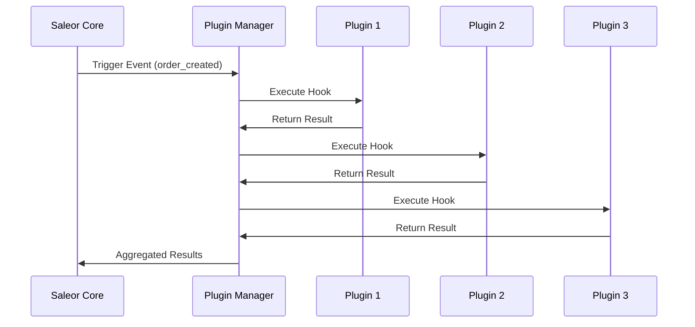

## Channel Architecture

### Multi-tenant Design

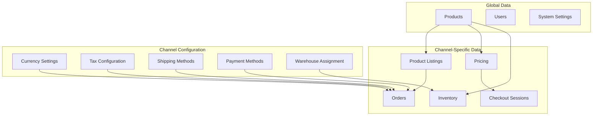

## Payment Processing Architecture

### Payment Flow

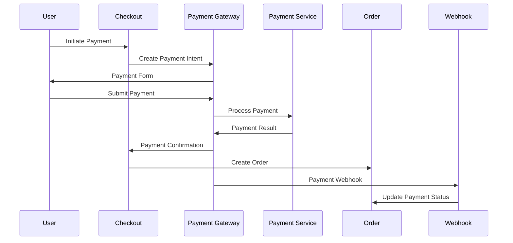

### Payment Gateway Integration

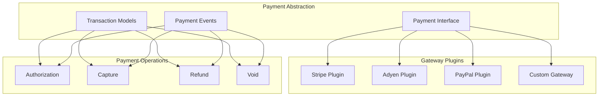

## Inventory & Fulfillment

### Inventory Management

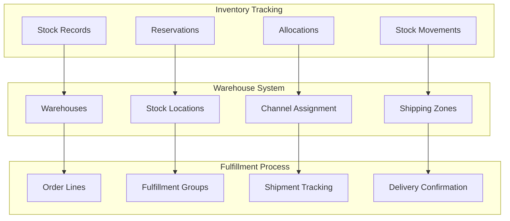

## Webhook System

### Webhook Architecture

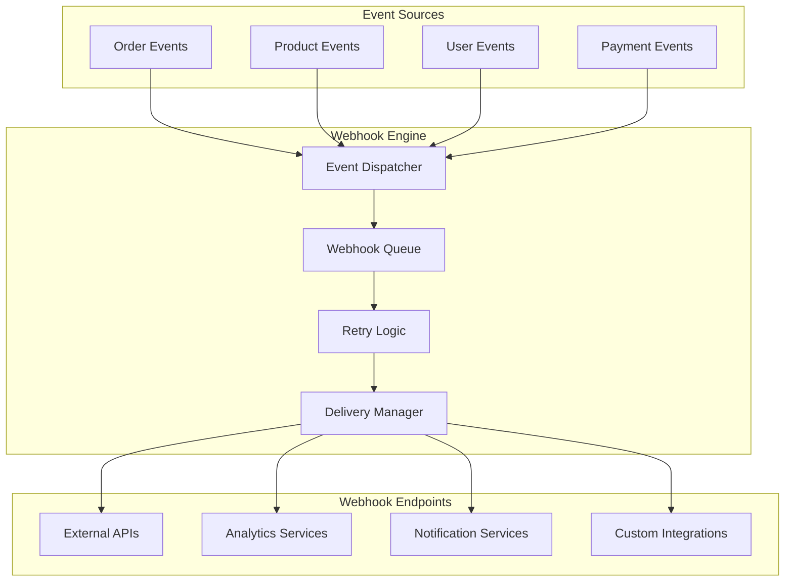

### Event Flow

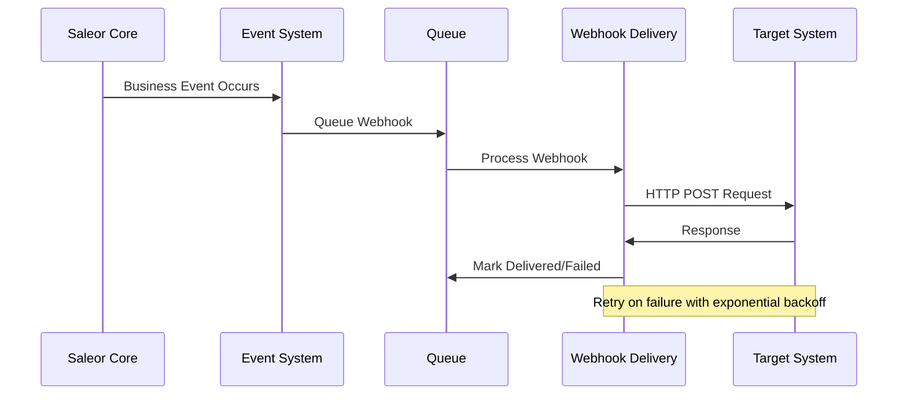

## Deployment Architecture

### Container Architecture

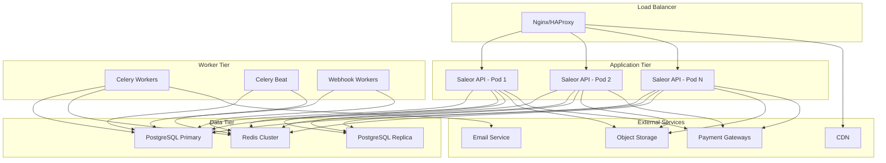

## Security Considerations

### Security Layers

```mermaid
graph TB
    subgraph "Network Security"
        A[HTTPS/TLS]
        B[API Rate Limiting]
        C[CORS Configuration]
        D[IP Filtering]
    end
    
    subgraph "Authentication Security"
        E[JWT Token Security]
        F[Password Policies]
        G[Account Lockout]
        H[MFA Support]
    end
    
    subgraph "Authorization Security"
        I[Permission Checks]
        J[Resource-Level Access]
        K[Channel Isolation]
        L[Data Privacy]
    end
    
    subgraph "Application Security"
        M[Input Validation]
        N[SQL Injection Prevention]
        O[XSS Protection]
        P[CSRF Protection]
    end
    
    A --> E
    B --> E
    C --> E
    D --> E
    E --> I
    F --> I
    G --> I
    H --> I
    I --> M
    J --> M
    K --> M
    L --> M
```

## Performance Optimization

### Caching Strategy

```mermaid
graph TB
    subgraph "Application Layer"
        A[Django View Cache]
        B[Template Fragment Cache]
        C[Database Query Cache]
    end
    
    subgraph "Data Layer"
        D[Redis Cache]
        E[Database Connection Pool]
        F[Query Optimization]
    end
    
    subgraph "Infrastructure Layer"
        G[CDN Caching]
        H[Static File Cache]
        I[API Response Cache]
    end
    
    A --> D
    B --> D
    C --> D
    D --> E
    D --> F
    G --> H
    H --> I
```

### Database Optimization

```mermaid
graph TB
    subgraph "Query Optimization"
        A[Database Indexes]
        B[Query Planning]
        C[N+1 Query Prevention]
        D[Prefetch Related]
    end
    
    subgraph "Connection Management"
        E[Connection Pooling]
        F[Read Replicas]
        G[Connection Limits]
        H[Query Timeouts]
    end
    
    subgraph "Data Management"
        I[Partitioning]
        J[Archival Strategy]
        K[Cleanup Tasks]
        L[Migration Strategy]
    end
    
    A --> E
    B --> E
    C --> E
    D --> E
    E --> I
    F --> I
    G --> I
    H --> I
```

## Development Workflow

### CI/CD Pipeline

```mermaid
graph LR
    subgraph "Development"
        A[Local Development]
        B[Feature Branch]
        C[Pull Request]
    end
    
    subgraph "Testing"
        D[Unit Tests]
        E[Integration Tests]
        F[API Tests]
        G[Security Scans]
    end
    
    subgraph "Deployment"
        H[Staging Deploy]
        I[Production Deploy]
        J[Rollback Capability]
    end
    
    A --> B
    B --> C
    C --> D
    D --> E
    E --> F
    F --> G
    G --> H
    H --> I
    I --> J
```

## Key Strengths

1. **Modern Architecture**: Clean separation of concerns with GraphQL API
2. **Scalability**: Multi-tenant design with channel-based isolation
3. **Extensibility**: Comprehensive plugin system for customization
4. **Developer Experience**: Well-structured codebase with comprehensive documentation
5. **Security**: Robust authentication and authorization system
6. **Performance**: Efficient caching and database optimization strategies
7. **Flexibility**: Headless design supports various frontend technologies

## Areas for Consideration

1. **Complexity**: Large codebase with many interdependencies
2. **Learning Curve**: Requires understanding of Django, GraphQL, and e-commerce concepts
3. **Resource Requirements**: Significant infrastructure needs for production deployment
4. **Migration Complexity**: Database schema changes can be complex due to multi-tenancy
5. **Plugin Dependencies**: Heavy reliance on plugins for extended functionality

## Conclusion

Saleor represents a well-architected, modern e-commerce platform that successfully balances flexibility with functionality. Its headless, API-first approach combined with a robust plugin system makes it suitable for complex, multi-channel commerce scenarios. The comprehensive permission system and multi-tenant architecture provide the foundation for scalable, secure e-commerce solutions.

The platform demonstrates excellent software engineering practices with clear separation of concerns, comprehensive testing, and maintainable code structure. While it requires significant technical expertise to deploy and customize effectively, it provides a solid foundation for building sophisticated e-commerce applications.