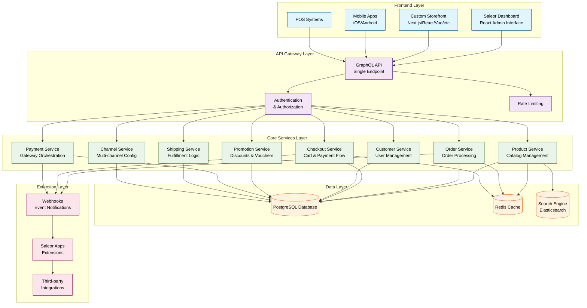
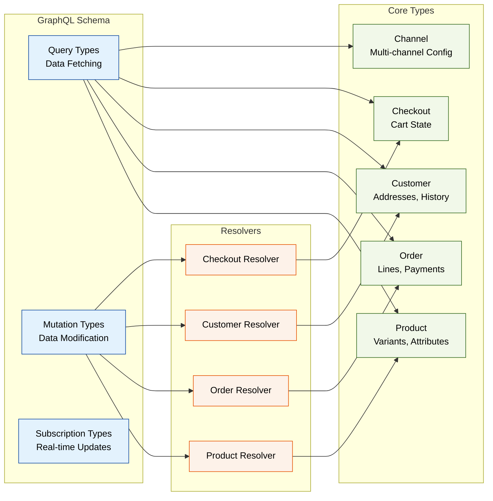
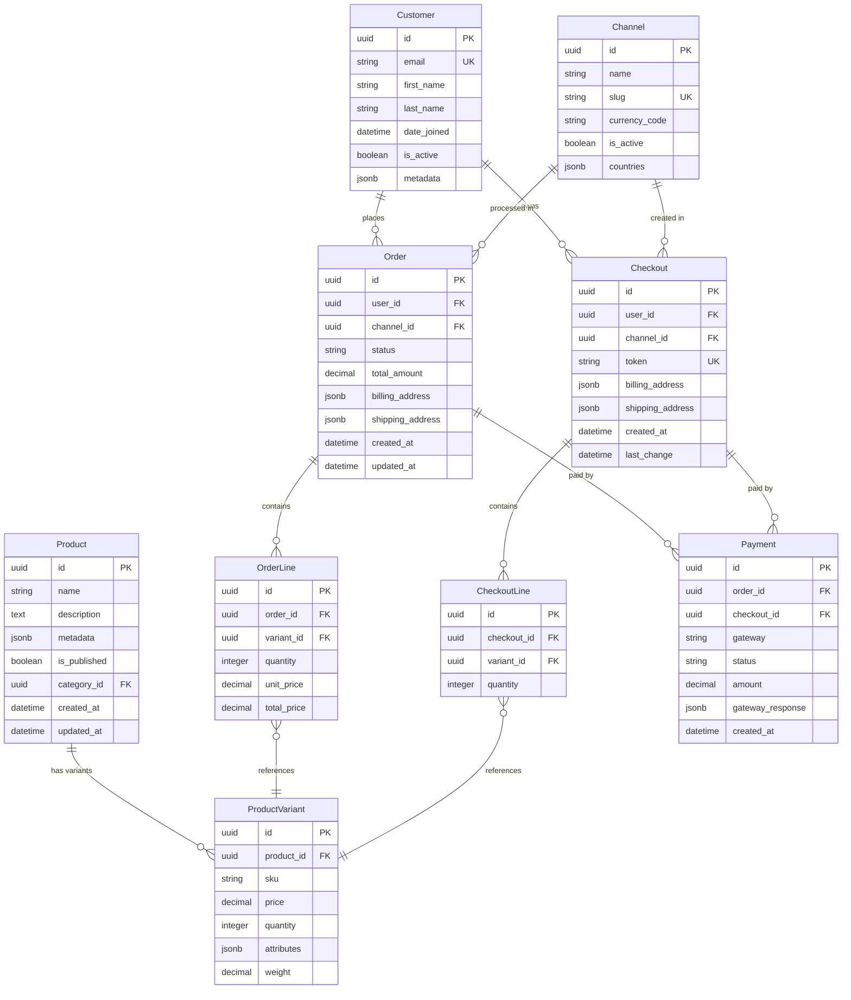
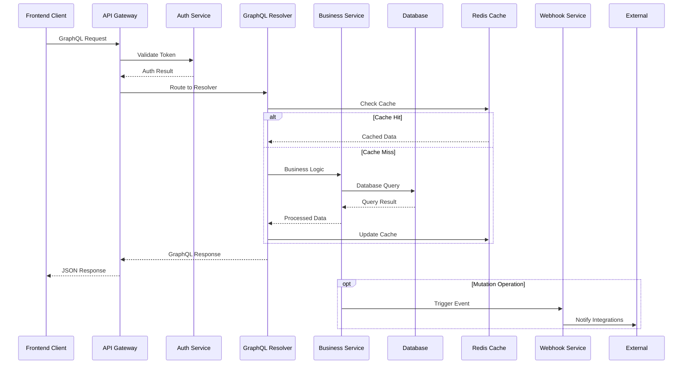
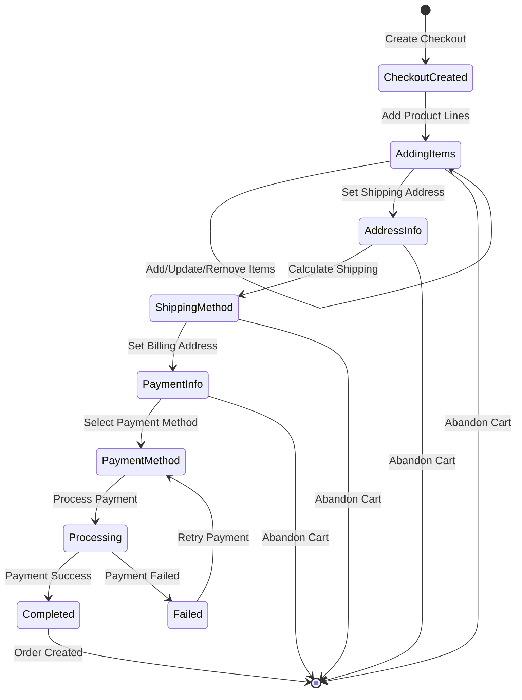
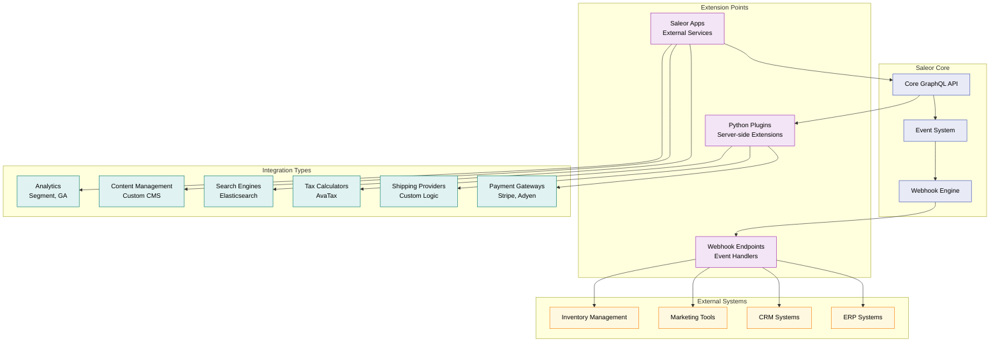
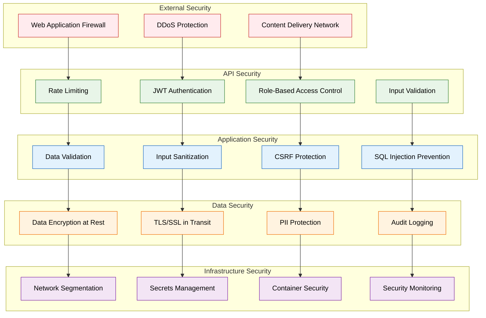
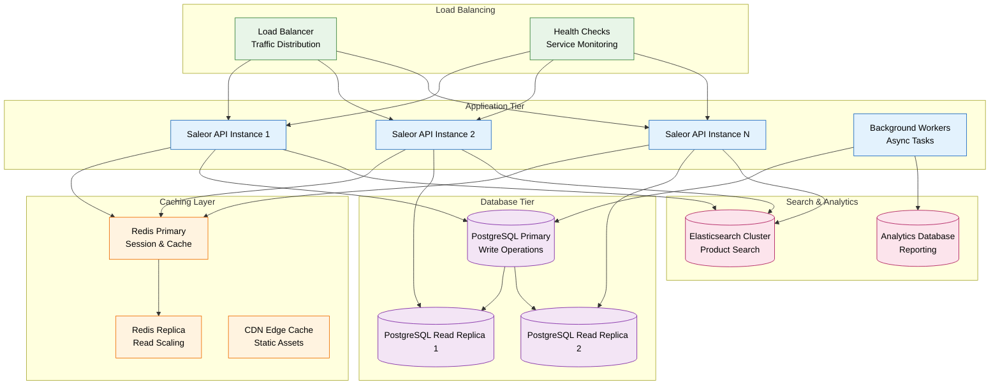
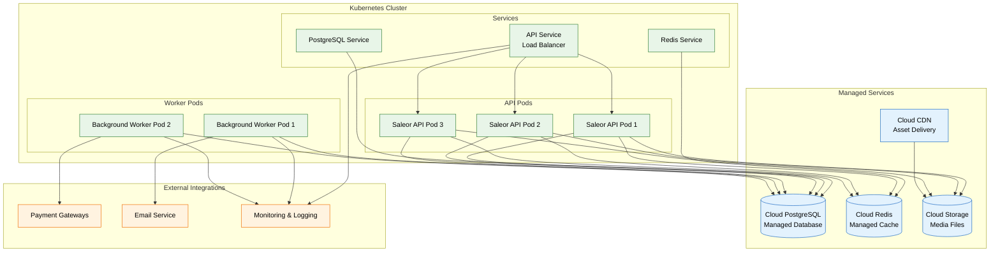

# Saleor E-commerce Platform - Comprehensive Architecture Review

## Executive Summary

Saleor is a modern, headless, API-first, composable e-commerce platform built with Python and GraphQL. It represents a paradigm shift from traditional monolithic e-commerce solutions to a flexible, microservices-inspired architecture that enables businesses to build custom commerce experiences across multiple channels.

## Core Architecture Overview

Saleor follows a **headless commerce** architecture pattern, where the backend (API) is completely decoupled from the frontend presentation layer. This separation enables maximum flexibility in how commerce experiences are delivered to customers.

### Key Architectural Principles

- **API-First Design**: All functionality is exposed through a comprehensive GraphQL API
- **Headless Architecture**: Complete separation between backend services and frontend applications
- **Composable Commerce**: Modular design allowing integration with best-of-breed services
- **Multi-Channel Support**: Built-in support for managing multiple sales channels
- **Extensible by Design**: Plugin architecture supporting custom business logic

## Technology Stack

### Backend Technologies
- **Primary Language**: Python
- **API Framework**: GraphQL (exclusively)
- **Database**: PostgreSQL (inferred from enterprise requirements)
- **Package Management**: UV/Poetry for dependency management
- **Code Quality**: Ruff for linting and code formatting

### Frontend Ecosystem
- **Dashboard**: React-based administrative interface
- **Storefront Reference**: Next.js, TypeScript, Tailwind CSS
- **Mobile Support**: API-driven, framework agnostic

### Infrastructure & DevOps
- **Containerization**: Docker support for deployment
- **Cloud-Native**: Designed for cloud deployment and scaling
- **Development Environment**: Docker-based local development

## System Architecture

### High-Level Architecture Diagram

## GraphQL API Architecture

Saleor's API is built exclusively on GraphQL, providing a single, unified endpoint for all client interactions.

### API Design Patterns

### Key GraphQL Features

- **Single Endpoint**: All operations go through one GraphQL endpoint
- **Type Safety**: Strong typing throughout the schema
- **Flexible Queries**: Clients request only needed data
- **Real-time Updates**: Subscription support for live data
- **Introspection**: Self-documenting API schema

## Data Layer Architecture

### Database Design Patterns

### Data Layer Features

- **PostgreSQL**: Primary database for transactional data
- **JSONB Fields**: Flexible metadata and attribute storage
- **UUID Primary Keys**: Globally unique identifiers
- **Multi-tenancy**: Channel-based data separation
- **Audit Trail**: Created/updated timestamps throughout

## API Flow and Request Processing

### Typical API Request Flow

### Checkout Flow Architecture

## Extension Architecture

### Plugin and App System

## Multi-Channel Architecture

### Channel Management System

```mermaid
graph TB
    subgraph "Global Configuration"
        GlobalSettings[Global Settings<br/>Base Configuration]
        GlobalCatalog[Master Catalog<br/>All Products]
    end
    
    subgraph "Channel A - US Market"
        ChannelA_Config[Channel Configuration<br/>USD, English, US Tax]
        ChannelA_Catalog[Product Subset<br/>US-Available Products]
        ChannelA_Pricing[Pricing Rules<br/>USD Prices]
        ChannelA_Inventory[Inventory<br/>US Warehouses]
    end
    
    subgraph "Channel B - EU Market"
        ChannelB_Config[Channel Configuration<br/>EUR, Multi-language, VAT]
        ChannelB_Catalog[Product Subset<br/>EU-Available Products]
        ChannelB_Pricing[Pricing Rules<br/>EUR Prices]
        ChannelB_Inventory[Inventory<br/>EU Warehouses]
    end
    
    subgraph "Channel C - Mobile App"
        ChannelC_Config[Channel Configuration<br/>Mobile-specific Settings]
        ChannelC_Catalog[Curated Catalog<br/>Mobile-optimized Products]
        ChannelC_Pricing[Dynamic Pricing<br/>App-exclusive Deals]
        ChannelC_Features[Mobile Features<br/>Push Notifications]
    end
    
    GlobalSettings --> ChannelA_Config
    GlobalSettings --> ChannelB_Config
    GlobalSettings --> ChannelC_Config
    
    GlobalCatalog --> ChannelA_Catalog
    GlobalCatalog --> ChannelB_Catalog
    GlobalCatalog --> ChannelC_Catalog
    
    classDef global fill:#e8f5e8,stroke:#2e7d32,color:#000
    classDef channelA fill:#e3f2fd,stroke:#1565c0,color:#000
    classDef channelB fill:#fce4ec,stroke:#c2185b,color:#000
    classDef channelC fill:#f3e5f5,stroke:#7b1fa2,color:#000
    
    class GlobalSettings,GlobalCatalog global
    class ChannelA_Config,ChannelA_Catalog,ChannelA_Pricing,ChannelA_Inventory channelA
    class ChannelB_Config,ChannelB_Catalog,ChannelB_Pricing,ChannelB_Inventory channelB
    class ChannelC_Config,ChannelC_Catalog,ChannelC_Pricing,ChannelC_Features channelC
```

## Security Architecture

### Security Layers and Controls

## Performance and Scalability

### Scaling Strategy

## Deployment Architecture

### Cloud-Native Deployment

## Key Technical Decisions and Trade-offs

### Architecture Decisions

1. **GraphQL-Only API**
   - **Benefits**: Single endpoint, type safety, efficient data fetching, self-documenting
   - **Trade-offs**: Learning curve, complexity for simple operations, caching challenges

2. **Headless Architecture**
   - **Benefits**: Frontend flexibility, multi-channel support, faster time-to-market
   - **Trade-offs**: Increased complexity, more development overhead, requires API expertise

3. **Python Backend**
   - **Benefits**: Rich ecosystem, rapid development, strong libraries for e-commerce
   - **Trade-offs**: Performance considerations for high-scale, GIL limitations

4. **PostgreSQL as Primary Database**
   - **Benefits**: ACID compliance, complex queries, JSONB support, reliability
   - **Trade-offs**: Scaling limitations, potential performance bottlenecks

5. **Event-Driven Extensions**
   - **Benefits**: Loose coupling, real-time integrations, scalability
   - **Trade-offs**: Eventual consistency, debugging complexity, infrastructure overhead

## Best Practices and Recommendations

### Development Best Practices

- **API Design**: Follow GraphQL best practices for schema design and query optimization
- **Security**: Implement proper authentication, authorization, and input validation
- **Performance**: Use caching strategies, database indexing, and query optimization
- **Testing**: Comprehensive testing including unit, integration, and API tests
- **Monitoring**: Implement proper logging, monitoring, and alerting

### Scalability Recommendations

- **Horizontal Scaling**: Use containerization and orchestration for API scaling
- **Database Optimization**: Implement read replicas and connection pooling
- **Caching Strategy**: Multi-layer caching with Redis and CDN
- **Search Optimization**: Dedicated search infrastructure for product discovery
- **Background Processing**: Async task processing for heavy operations

### Integration Patterns

- **Webhook-First**: Use webhooks for real-time integrations
- **API Gateway**: Implement API gateway for external service management
- **Circuit Breaker**: Implement circuit breaker pattern for external dependencies
- **Retry Logic**: Implement exponential backoff for failed operations

## Conclusion

Saleor represents a modern approach to e-commerce platform architecture, emphasizing flexibility, scalability, and developer experience. Its headless, API-first design enables businesses to create unique commerce experiences while maintaining robust backend functionality.

The platform's composable architecture, comprehensive GraphQL API, and extensive extension capabilities make it suitable for businesses ranging from mid-market to enterprise scale. However, the complexity of its architecture requires teams with strong API development skills and experience with distributed systems.

Key strengths include its modern technology stack, flexible data model, comprehensive API coverage, and strong extension architecture. Organizations considering Saleor should evaluate their technical capabilities, integration requirements, and long-term scalability needs to determine if this architecture aligns with their business goals.
