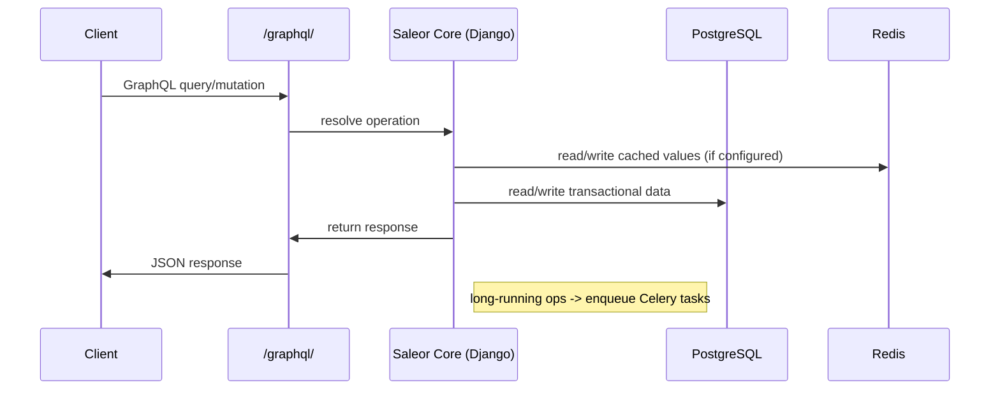
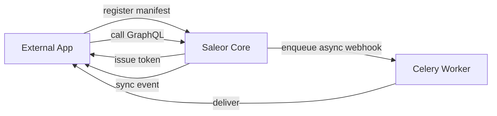
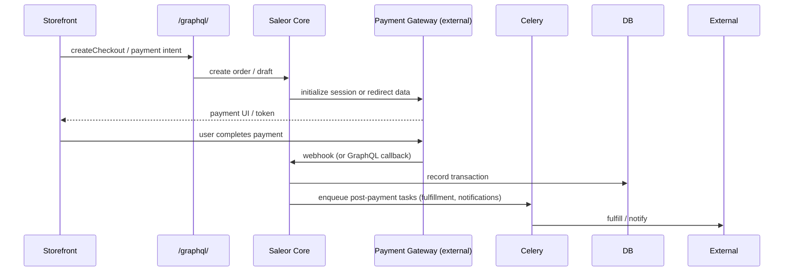

# Saleor — Comprehensive System Architecture & API Review

*Generated by ChatGPT — organized as a single-file system-review intended for engineers who want a fast but deep understanding of Saleor Core and its ecosystem.*

---

## Table of contents

1. Overview
2. High-level architecture (diagram)
3. Core components
4. Data layers
5. API surface & request flow (GraphQL first)
6. Extensions, apps and webhooks (diagram)
7. Background processing & async flows
8. Search & indexing
9. Payments & checkout flow (diagram)
10. Deployment, scaling & infra patterns
11. Observability, testing & CI notes
12. Extensibility points and developer workflows
13. Quick repo notes & pointers
14. Recommendations & gotchas

---

## 1) Overview

Saleor is a headless, GraphQL-first e‑commerce platform (API-only backend) designed to be composable and horizontally scalable. It intentionally separates the responsibilities of core commerce logic (Saleor Core) from UI and integrations (Storefront, Dashboard, Apps), enabling teams to pick technologies for each piece while relying on a stable GraphQL contract.

Key design goals:
- GraphQL-native API (single canonical API surface)
- Headless & composable (storefronts, dashboards, apps are decoupled)
- Extensible via Apps, Webhooks, and API Extensions
- Cloud-friendly and horizontally scalable components

---

## 2) High-level architecture

```mermaid
flowchart LR
  subgraph ClientTier
    A[Storefronts / PWAs / Mobile] -->|GraphQL| B[Public API / BFF]
    C[Dashboard / Admin] -->|GraphQL| B
    D[3rd-party apps/services] -->|Webhooks / GraphQL| B
  end

  subgraph APIPlatform
    B --> E[Saleor Core (Django + GraphQL)]
    E --> F[(PostgreSQL)]
    E --> G[(Redis cache & broker)]
    E --> H[(Celery workers)]
    E --> I[(Search service: Postgres or Elasticsearch/Algolia)]
    E --> J[(Storage: S3 / object store)]
  end

  subgraph Integrations
    H --> K[Webhook Consumers / Apps]
    E --> L[Payment gateways / external APIs]
  end
```

Short summary: clients talk to a single GraphQL endpoint exposed by Saleor Core. Background tasks (workers) handle long-running jobs, webhooks, and indexing. Persistent state is modeled in PostgreSQL; caches and brokers use Redis; search may use Postgres, Elasticsearch, or external search apps.

---

## 3) Core components

- **Saleor Core**: Python/Django application implementing business models, GraphQL schema (queries & mutations), policies, and domain logic.
- **GraphQL API**: Single canonical API at `/graphql/` supporting public operations (storefront) and private/admin operations (dashboard & apps). Uses GraphQL types, mutations, queries and supports event queries & subscriptions patterns where needed.
- **Dashboard**: Decoupled React-based admin UI (separate repo) interacting solely via GraphQL and embeddable admin apps.
- **Storefront example**: React/Next.js example storefront repository that acts as a reference client.
- **Apps & Webhooks**: External services/apps integrate via a manifest+register flow and receive webhooks or call GraphQL using tokens.
- **Plugins**: Internal plugin mechanism for payment gateways, shipping, and local customizations.

---

## 4) Data layers

1. **Relational store (PostgreSQL)** — primary source of truth for users, products, orders, inventory, channels, translations, promotions, and transactional data.
   - Django models map domain objects and migrations manage schema.
2. **Search / Index** — search for catalog browsing can be powered by Postgres (default), or pushed to search engines like Elasticsearch, Algolia, Meili or Typesense via apps/plugins.
3. **Caching & broker (Redis)** — used for caching (fast lookups), Celery broker/back-end, and transient state.
4. **Background workers (Celery)** — execute asynchronous tasks: price recalculations, indexing, async webhook delivery, order post-processing, scheduled jobs.
5. **Object storage (S3 or compatible)** — for media, thumbnails and exported assets.
6. **External integrations** — payment gateways, fulfillment providers, tax & shipping providers. These live outside DB but their state is often mirrored (transactions, refunds, shipping status).

---

## 5) API surface & request flow

### API principles
- Single GraphQL endpoint: `/graphql/` accepts POST JSON payloads.
- API types separate public vs. private operations via permissions and tokens.
- Webhooks + event queries let apps react to domain events without polling.
- API Extensions & Subscription-like facilities allow apps to augment or listen to events.

### Typical request flow (simplified)



Notes:
- Mutations that change orders, inventory, or prices may enqueue background tasks for recalculation and webhook delivery.
- Access control enforced in resolvers and by decorators middleware.

---

## 6) Extensions, apps and webhooks

Saleor's extension model allows external apps to register via a manifest and token flow. Communication options:
- GraphQL calls (apps call `/graphql/` with a token)
- Synchronous webhooks (Saleor expects fast responses; limited timeout)
- Asynchronous webhooks delivered by worker queue (recommended for slower handlers)



Auth Persistence Layer (APL): apps must persist the Saleor domain token pair; Saleor provides abstractions to help apps store tokens for later calls.

---

## 7) Background processing & async flows

- **Celery** is used in Saleor for background tasks (workers discover tasks via autodiscover). Example jobs: search reindexing, webhook deliveries, post-checkout processing.
- **Redis** is commonly used as Celery broker (`CELERY_BROKER_URL` often points to `redis://…`).
- Some tasks have strict timeouts (e.g., synchronous webhook timeouts); asynchronous delivery via workers is the robust path.

---

## 8) Search & indexing

- Default: Postgres-powered search for smaller installations (simpler setup).
- For large catalogs and faster faceted queries, Saleor supports external search backends (Elasticsearch/Algolia). Search may be implemented either via a plugin/app that maintains indexes or via built-in integrations.
- Indexing pipeline: model changes -> signals -> enqueue indexing job -> worker updates search index.

---

## 9) Payments & checkout flow

Payments are handled via a pluggable gateway architecture. The system supports multiple patterns (CHARGE, AUTHORIZATION), multi‑gateway orchestration, and plugin-driven flows.



Common considerations:
- Payment flows must be idempotent and eventually consistent (webhooks can arrive out of order).
- Some gateways require synchronous checks that must be performed within webhook timeout limits.

---

## 10) Deployment, scaling & infra patterns

- **Local dev**: Saleor can be run locally with docker-compose or via the Saleor Platform repo that scaffolds Core + Storefront + Dashboard.
- **Production**:
  - Core: multiple instances behind a load balancer; stateless app servers
  - Database: PostgreSQL (primary + replicas)
  - Workers: separate Celery worker pool(s) scaled independently
  - Cache & broker: Redis cluster
  - Search: separate service (Elasticsearch/Algolia) if used
  - Object storage: S3 (or S3-compatible) for media
- **Scaling knobs**: scale API servers for request throughput, scale workers for async load, scale DB and search independently.

---

## 11) Observability, testing & CI notes

- Tests: repo includes pytest setup and fixtures. In CI, background tasks are often disabled or run in a mocked mode.
- Logging and metrics should be aggregated via centralized systems (Prometheus/Grafana, ELK).
- Saleor Cloud / Platform offers managed options; self-hosters must configure monitoring for DB, workers, and external integrations.

---

## 12) Extensibility points and developer workflows

- **Apps**: implement manifest + register endpoints; choose communication via webhooks or GraphQL.
- **Plugins**: local Python plugins (e.g., payment gateway plugin) by adding to `PLUGINS` in `settings.py`.
- **API Extensions**: can add custom types or extend resolvers via API extension features.
- **Dashboard apps**: embed into the admin as iframes using manifest entries.

Dev workflow suggestions:
- Use Saleor Platform for local multi-service dev
- Use feature branches + review apps (Saleor supports ephemeral test deployments in CI)
- Rely on plugin discovery for custom tasks and ensure plugins are in settings so Celery autodiscovery picks up tasks

---

## 13) Quick repo notes & pointers (where to look)

- `manage.py` — Django management hooks and convenience commands.
- `saleor/settings.py` — configuration, including `PLUGINS`, Celery and cache settings.
- `saleor/core` or domain modules — domain models and business logic.
- `saleor/graphql` — GraphQL schema, types, resolvers, mutations.
- `saleor/celeryconf.py` — Celery config & autodiscover logic.
- `deployment/` and `Dockerfile` — containerization and deployment patterns.
- `docs/` and docs.saleor.io — canonical architecture and API references.

---

## 14) Recommendations & gotchas

- **Run a Celery worker in production** — many operations (reindex, price recalculation, webhooks) rely on background processing.
- **Plan search early** — small catalogs can use Postgres; at scale pick an external search provider and a syncing strategy.
- **Design for idempotency** — webhooks and async tasks can be retried; ensure database operations are safe for retries.
- **Monitor webhook/app timeouts** — synchronous webhook flows are time-limited; prefer async mode for heavy processing.
- **Use the API-first approach for BFFs** — build a Backend-for-Frontend if you need storefront-specific caching, composition, or SSR performance tricks.

---

### Closing notes

This review gives an engineer-oriented tour of Saleor's architecture and operational model. For implementation details, API references, and current deployment recommendations, consult the official docs and the `saleor` repository (this file summarizes structural and architectural aspects found across the codebase and docs).

*End of review.*

