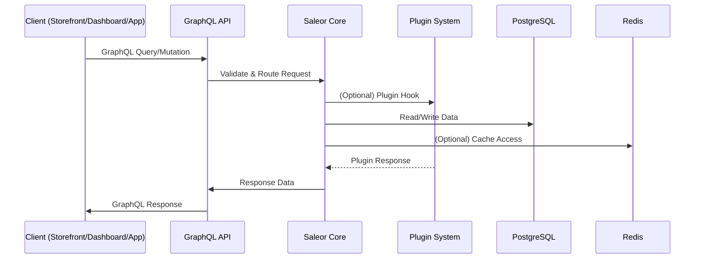
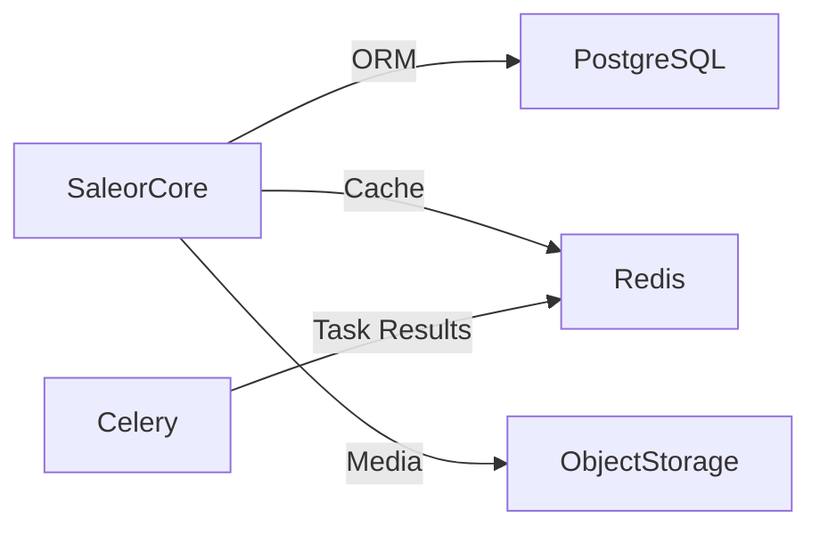
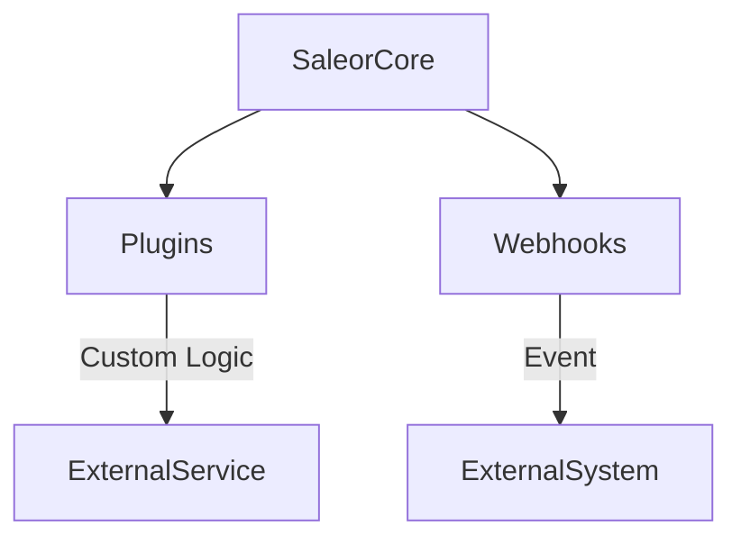
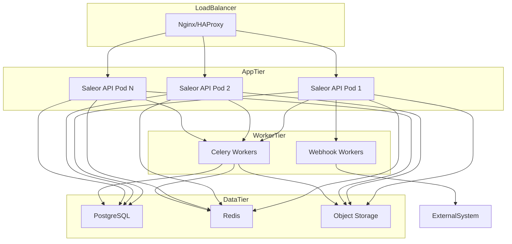

# Saleor: Comprehensive System Architecture Review (Copilot Edition)

## Introduction

Saleor is a modern, open-source, headless e-commerce platform built with Python and Django. It features a GraphQL-native, API-first approach, enabling high flexibility, scalability, and composability for a wide range of commerce applications. This review provides a deep dive into Saleor's system architecture, API flow, data layers, extensibility, and operational model, with Mermaid diagrams for clarity.

---

## 1. System Architecture

Saleor is designed as a headless, service-oriented platform. The backend is decoupled from the frontend, allowing any technology stack for the user interface. The core system is API-only, with all business logic exposed via a robust GraphQL API.

```mermaid
graph TD;
    subgraph Frontend
        Storefront[Storefront (Next.js, React, etc.)];
        Dashboard[Dashboard (React)];
        CustomApps[Custom Apps];
    end

    subgraph API Layer
        GraphQLAPI[GraphQL API];
    end

    subgraph Backend
        SaleorCore[Saleor Core (Django)];
        Plugins[Plugin System];
        Webhooks[Webhooks];
        Celery[Celery Workers];
    end

    subgraph Data
        PostgreSQL[PostgreSQL];
        Redis[Redis Cache];
        ObjectStorage[Object Storage];
    end

    Storefront --> GraphQLAPI
    Dashboard --> GraphQLAPI
    CustomApps --> GraphQLAPI
    GraphQLAPI --> SaleorCore
    SaleorCore --> Plugins
    SaleorCore --> Webhooks
    SaleorCore --> Celery
    SaleorCore --> PostgreSQL
    SaleorCore --> Redis
    SaleorCore --> ObjectStorage
```

**Key Components:**
- **Frontend:** Storefront, Dashboard, and custom apps (technology-agnostic)
- **API Layer:** GraphQL API (single entry point)
- **Backend:** Django-based core, plugin system, webhooks, async workers
- **Data:** PostgreSQL (primary DB), Redis (cache), object storage (media)

---

## 2. API Flow

Saleor exposes a comprehensive GraphQL API for all operations. The API is the only way to interact with the backend, ensuring a clean separation of concerns and enabling headless commerce.



- **Authentication:** JWT-based, with fine-grained permissions
- **Extensibility:** Plugins and webhooks can intercept and extend API flows
- **Subscriptions:** Real-time updates via GraphQL subscriptions

---

## 3. Data Layer

Saleor's data layer is built for reliability and performance:
- **PostgreSQL:** Main relational database for all business data
- **Redis:** Used for caching, background tasks, and rate limiting
- **Object Storage:** For media files (S3, GCS, Azure Blob, etc.)



- **ORM:** Django ORM for database access
- **Migrations:** Managed via Django migrations
- **Multi-tenancy:** Channel-based isolation for multi-store setups

---

## 4. Extensibility: Plugins & Webhooks

Saleor is highly extensible via plugins and webhooks:
- **Plugins:** Python modules that can hook into business logic (e.g., payments, shipping)
- **Webhooks:** Asynchronous event notifications to external systems
- **Apps:** External services can extend Saleor via the API and webhooks



---

## 5. Deployment & Infrastructure

Saleor is cloud-native and container-friendly. A typical deployment involves:



- **Kubernetes/Docker:** Recommended for orchestration
- **Horizontal Scaling:** Stateless API pods, scalable worker pools
- **External Integrations:** Payment gateways, email, CDN, etc.

---

## 6. Security & Permissions

- **Authentication:** JWT tokens, OAuth2 support
- **Authorization:** Role-based, per-object permissions
- **Data Protection:** Secure storage, encrypted connections
- **Auditability:** Event logging and webhook delivery tracking

---

## 7. Key Strengths & Considerations

**Strengths:**
- Modern, composable, and scalable architecture
- API-first, headless design
- Multi-channel, multi-tenant support
- Robust extensibility (plugins, webhooks, apps)
- Cloud-native, production-ready

**Considerations:**
- Steep learning curve for new developers
- Requires solid DevOps for production
- Complex migrations in multi-tenant setups

---

## 8. Conclusion

Saleor is a best-in-class, headless commerce platform with a clean, extensible architecture. Its API-first approach, robust plugin/webhook system, and cloud-native design make it suitable for modern, scalable e-commerce solutions.

---

*Generated by GitHub Copilot, September 2025.*
