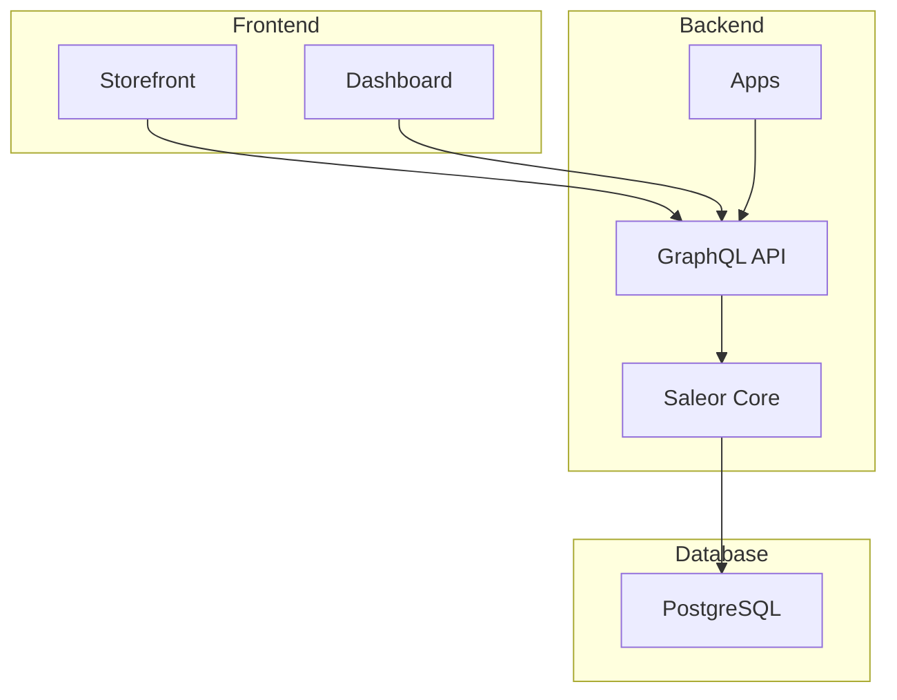
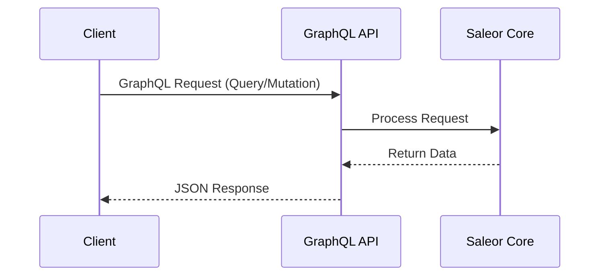
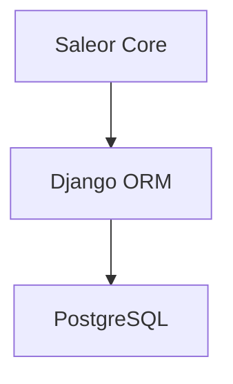

# Saleor: A Comprehensive Review

## Introduction

Saleor is a modern, open-source, and headless e-commerce platform. It is built with a GraphQL-native, API-first approach, which makes it highly flexible and suitable for a wide range of e-commerce applications. This review provides a comprehensive overview of Saleor's system architecture, API flow, data layer, and key features, now with Mermaid diagrams for better visualization.

## System Architecture

Saleor's architecture is designed for scalability, flexibility, and performance. It follows a headless, service-oriented model, which decouples the backend from the frontend. This allows for a high degree of customization and the ability to use any frontend technology.

The main components of the Saleor architecture are:

*   **Saleor Core:** The heart of the platform, built with Python and the Django framework. It contains all the business logic, including product management, order processing, and customer management.
*   **GraphQL API:** The single point of entry for all interactions with the Saleor Core. It is a comprehensive and well-documented API that allows for efficient data retrieval and manipulation.
*   **Dashboard:** A modern, React-based administrative interface for managing the e-commerce store.
*   **Storefront:** Saleor provides a default PWA (Progressive Web App) storefront built with Next.js, React, and TypeScript. However, thanks to the headless nature of the platform, developers are free to build their own storefronts using any technology they prefer.
*   **Apps:** Saleor's extensibility model is based on "apps." These are independent applications that can be used to add new features and integrations to the platform. This approach avoids the limitations of traditional monolithic plugin architectures.

## API Flow

Saleor's API is based entirely on GraphQL. This has several advantages over traditional REST APIs:

*   **Efficiency:** GraphQL allows clients to request exactly the data they need, which reduces the amount of data transferred over the network and improves performance.
*   **Flexibility:** The GraphQL schema is strongly typed and self-documenting, which makes it easy for developers to understand and use the API.
*   **Real-time Capabilities:** Saleor's GraphQL API supports subscriptions, which allow for real-time updates to be pushed to clients.

The API is divided into two main parts:

*   **Public API:** Used by storefronts and other public-facing applications. It provides access to public data, such as product information and categories.
*   **Admin API:** Used by the dashboard and other administrative tools. It provides full access to all the features of the platform, including order management, customer management, and store configuration.

Authentication is handled using JSON Web Tokens (JWT).

## Data Layer

Saleor's data layer is built on top of a PostgreSQL database. The Saleor Core uses the Django ORM (Object-Relational Mapper) to interact with the database. This abstracts away the underlying database and allows for a more Pythonic way of working with data.

The data flow in Saleor is as follows:

1.  A client (e.g., a storefront or the dashboard) sends a GraphQL query or mutation to the Saleor API.
2.  The Saleor Core receives the request and uses the Django ORM to interact with the PostgreSQL database.
3.  The data is retrieved from or written to the database.
4.  The Saleor Core sends a response back to the client in the form of a JSON object.

This data layer is designed to be highly scalable and can handle a large number of products, customers, and orders.

## Key Features

Saleor comes with a rich set of features that are essential for any e-commerce platform:

*   **Product Management:** A flexible product model that supports different product types, attributes, and variants.
*   **Order Management:** A comprehensive order management system that supports different payment and shipping methods.
*   **Customer Management:** A system for managing customer accounts, addresses, and order history.
*   **Promotions:** A powerful promotion engine that supports discounts, vouchers, and sales.
*   **Internationalization:** Support for multiple languages, currencies, and tax rates.
*   **SEO:** Tools for optimizing the store for search engines.
*   **Extensibility:** A flexible app-based extensibility model that allows for the addition of new features and integrations.

## Conclusion

Saleor is a powerful and flexible e-commerce platform that is well-suited for a wide range of applications. Its modern, API-first architecture, combined with its rich feature set, makes it an excellent choice for businesses that are looking for a scalable and customizable e-commerce solution. The use of GraphQL, Python, and Django makes it a very developer-friendly platform.
