# Comprehensive Technical Analysis: saleor/saleor

## Repository Overview

**Repository:** saleor/saleor  
**Description:** Saleor Core: the high performance, composable, headless commerce API.  
**Language:** Python  
**Stars:** 21,992  
**Forks:** 5,782  
**Topics:** python, store, commerce, shop, ecommerce, cart, graphql, headless, headless-commerce, multichannel, shopping-cart, composable, oms, pim, checkout, payments, order-management, e-commerce  
**License:** BSD 3-Clause "New" or "Revised" License  
**Size:** 238,909 KB  
**Analysis Date:** 2025-08-31 16:38:27  

## 🏗️ System Architecture

This section contains Mermaid diagrams that visualize the system architecture. 
Copy the diagram code to [Mermaid Live](https://mermaid.live) to view the interactive diagrams.

### Overall System Architecture

```mermaid
graph TB
    subgraph "Client Layer"
        WEB["🌐 Web Applications"]
        MOBILE["📱 Mobile Apps"]
        API_CLIENTS["🔧 API Clients"]
    end

    subgraph "API Gateway Layer"
        NGINX["🔀 NGINX/Load Balancer"]
        CORS["🛡️ CORS Middleware"]
        RATE_LIMIT["⚡ Rate Limiting"]
    end

    subgraph "Application Layer"
        DJANGO["🐍 Django Application"]
        GRAPHQL["🔗 GraphQL API"]
        ASGI["⚙️ ASGI Server (Uvicorn)"]
        
        subgraph "Core Modules"
            ACCOUNT["👤 Account Management"]
            PRODUCT["📦 Product Catalog"]
            ORDER["📝 Order Management"]
            CHECKOUT["🛒 Checkout Process"]
            PAYMENT["💳 Payment Processing"]
            SHIPPING["🚚 Shipping & Logistics"]
            WAREHOUSE["🏪 Warehouse Management"]
            CHANNEL["📺 Multi-Channel"]
            WEBHOOK["🔔 Webhook System"]
        end
    end

    subgraph "Background Processing"
        CELERY["🔄 Celery Workers"]
        BEAT["⏰ Celery Beat Scheduler"]
        REDIS_QUEUE["📋 Redis Task Queue"]
    end

    subgraph "Data Layer"
        POSTGRES["🐘 PostgreSQL"]
        REDIS["⚡ Redis Cache"]
        S3["☁️ Cloud Storage (S3/GCS/Azure)"]
    end

    subgraph "External Services"
        PAYMENT_GW["💰 Payment Gateways\n(Stripe, Adyen, etc.)"]
        SHIPPING_API["🚛 Shipping APIs"]
        TAX_SERVICE["📊 Tax Services"]
        EMAIL["📧 Email Services"]
        MONITORING["📈 Monitoring\n(Sentry, OpenTelemetry)"]
    end

    subgraph "Extension Layer"
        PLUGINS["🔌 Plugin System"]
        APPS["📱 Saleor Apps"]
        WEBHOOKS["🪝 External Webhooks"]
    end

    %% Client connections
    WEB --> NGINX
    MOBILE --> NGINX
    API_CLIENTS --> NGINX

    %% API Gateway connections
    NGINX --> CORS
    CORS --> RATE_LIMIT
    RATE_LIMIT --> ASGI

    %% Application layer connections
    ASGI --> DJANGO
    DJANGO --> GRAPHQL
    GRAPHQL --> ACCOUNT
    GRAPHQL --> PRODUCT
    GRAPHQL --> ORDER
    GRAPHQL --> CHECKOUT
    GRAPHQL --> PAYMENT
    GRAPHQL --> SHIPPING
    GRAPHQL --> WAREHOUSE
    GRAPHQL --> CHANNEL
    GRAPHQL --> WEBHOOK

    %% Background processing
    DJANGO --> CELERY
    CELERY --> REDIS_QUEUE
    BEAT --> REDIS_QUEUE

    %% Data layer connections
    DJANGO --> POSTGRES
    DJANGO --> REDIS
    DJANGO --> S3
    CELERY --> POSTGRES
    CELERY --> REDIS

    %% External service connections
    PAYMENT --> PAYMENT_GW
    SHIPPING --> SHIPPING_API
    ORDER --> TAX_SERVICE
    DJANGO --> EMAIL
    DJANGO --> MONITORING

    %% Extension layer
    WEBHOOK --> PLUGINS
    PLUGINS --> APPS
    WEBHOOK --> WEBHOOKS

    classDef clientLayer fill:#e1f5fe
    classDef apiLayer fill:#f3e5f5
    classDef appLayer fill:#e8f5e8
    classDef bgLayer fill:#fff3e0
    classDef dataLayer fill:#fce4ec
    classDef externalLayer fill:#f1f8e9
    classDef extensionLayer fill:#fff8e1

    class WEB,MOBILE,API_CLIENTS clientLayer
    class NGINX,CORS,RATE_LIMIT apiLayer
    class DJANGO,GRAPHQL,ASGI,ACCOUNT,PRODUCT,ORDER,CHECKOUT,PAYMENT,SHIPPING,WAREHOUSE,CHANNEL,WEBHOOK appLayer
    class CELERY,BEAT,REDIS_QUEUE bgLayer
    class POSTGRES,REDIS,S3 dataLayer
    class PAYMENT_GW,SHIPPING_API,TAX_SERVICE,EMAIL,MONITORING externalLayer
    class PLUGINS,APPS,WEBHOOKS extensionLayer
```

### API Flow Diagram

```mermaid
sequenceDiagram
    participant Client as 🌐 Client Application
    participant Gateway as 🔀 API Gateway
    participant Auth as 🔐 Authentication
    participant GraphQL as 🔗 GraphQL Resolver
    participant Service as ⚙️ Business Service
    participant DB as 🐘 Database
    participant Cache as ⚡ Redis Cache
    participant Queue as 📋 Task Queue
    participant External as 🌍 External API
    participant Webhook as 🔔 Webhook

    Note over Client,Webhook: GraphQL Query/Mutation Flow
    
    Client->>Gateway: HTTP Request with GraphQL Query
    Gateway->>Auth: Validate JWT Token
    Auth-->>Gateway: Token Valid + Permissions
    Gateway->>GraphQL: Route to GraphQL Endpoint
    
    GraphQL->>GraphQL: Parse & Validate Query
    GraphQL->>Auth: Check Field-Level Permissions
    Auth-->>GraphQL: Permission Granted
    
    GraphQL->>Cache: Check Cache for Data
    alt Cache Hit
        Cache-->>GraphQL: Return Cached Data
    else Cache Miss
        GraphQL->>Service: Execute Business Logic
        Service->>DB: Database Query
        DB-->>Service: Return Data
        Service->>Cache: Store in Cache
        Service-->>GraphQL: Return Result
    end
    
    Note over Service,External: External Integration (if needed)
    Service->>External: API Call (Payment/Shipping)
    External-->>Service: Response
    
    Note over Service,Queue: Background Task (if needed)
    Service->>Queue: Queue Background Task
    Queue-->>Service: Task Queued
    
    GraphQL-->>Gateway: GraphQL Response
    Gateway-->>Client: HTTP Response
    
    Note over Queue,Webhook: Background Processing
    Queue->>Service: Execute Background Task
    Service->>DB: Update Database
    Service->>Webhook: Trigger Webhook Event
    Webhook->>External: Send Webhook Notification
    
    Note over Client,Webhook: Real-time Subscription Flow
    Client->>GraphQL: WebSocket Subscription
    GraphQL->>Client: Subscription Established
    Service->>GraphQL: Event Triggered
    GraphQL->>Client: Push Real-time Update
```

### Component Architecture

```mermaid
graph TB
    subgraph "Presentation Layer"
        subgraph "GraphQL API"
            SCHEMA["📋 GraphQL Schema"]
            RESOLVERS["🔍 Resolvers"]
            SUBSCRIPTIONS["🔔 Subscriptions"]
            DATALOADERS["📊 DataLoaders"]
        end
        
        subgraph "REST Endpoints"
            WEBHOOKS["🪝 Webhook Endpoints"]
            DOWNLOADS["⬇️ Digital Downloads"]
            THUMBNAILS["🖼️ Image Thumbnails"]
            JWKS["🔑 JWKS Endpoint"]
        end
    end

    subgraph "Application Layer"
        subgraph "Domain Services"
            ACCOUNT_SVC["👤 Account Service"]
            PRODUCT_SVC["📦 Product Service"]
            ORDER_SVC["📝 Order Service"]
            PAYMENT_SVC["💳 Payment Service"]
            CHECKOUT_SVC["🛒 Checkout Service"]
            SHIPPING_SVC["🚚 Shipping Service"]
            INVENTORY_SVC["📊 Inventory Service"]
            DISCOUNT_SVC["🎁 Discount Service"]
        end
        
        subgraph "Cross-cutting Services"
            AUTH_SVC["🔐 Authentication"]
            PERM_SVC["🛡️ Permission Service"]
            WEBHOOK_SVC["📡 Webhook Service"]
            CHANNEL_SVC["📺 Channel Service"]
            PLUGIN_SVC["🔌 Plugin Service"]
            CACHE_SVC["⚡ Cache Service"]
        end
    end

    subgraph "Infrastructure Layer"
        subgraph "Data Access"
            ORM["🗄️ Django ORM"]
            QUERY_OPT["⚡ Query Optimization"]
            MIGRATIONS["🔄 Database Migrations"]
            FULL_TEXT["🔍 Full-text Search"]
        end
        
        subgraph "External Integrations"
            PAYMENT_GW["💰 Payment Gateways"]
            STORAGE["☁️ Cloud Storage"]
            EMAIL_SVC["📧 Email Service"]
            TAX_SVC["📊 Tax Services"]
            SHIPPING_API["🚛 Shipping APIs"]
        end
        
        subgraph "Background Processing"
            TASK_QUEUE["📋 Celery Tasks"]
            SCHEDULER["⏰ Task Scheduler"]
            WORKERS["👷 Worker Processes"]
            MONITORING["📈 Task Monitoring"]
        end
    end

    subgraph "Data Layer"
        subgraph "Primary Storage"
            PG_MAIN["🐘 PostgreSQL (Primary)"]
            PG_READ["🐘 PostgreSQL (Replica)"]
            REDIS["⚡ Redis"]
        end
        
        subgraph "File Storage"
            MEDIA["📁 Media Files"]
            STATIC["🎨 Static Assets"]
            TEMP["📂 Temporary Files"]
        end
    end

    subgraph "Observability"
        TELEMETRY["📊 OpenTelemetry"]
        LOGGING["📝 Structured Logging"]
        METRICS["📈 Application Metrics"]
        TRACING["🔍 Distributed Tracing"]
        ERROR_TRACK["🐛 Error Tracking"]
    end

    %% Presentation to Application
    SCHEMA --> RESOLVERS
    RESOLVERS --> ACCOUNT_SVC
    RESOLVERS --> PRODUCT_SVC
    RESOLVERS --> ORDER_SVC
    RESOLVERS --> PAYMENT_SVC
    RESOLVERS --> CHECKOUT_SVC
    RESOLVERS --> SHIPPING_SVC
    RESOLVERS --> INVENTORY_SVC
    RESOLVERS --> DISCOUNT_SVC
    
    WEBHOOKS --> WEBHOOK_SVC
    DOWNLOADS --> PRODUCT_SVC
    THUMBNAILS --> CACHE_SVC
    JWKS --> AUTH_SVC

    %% Cross-cutting services
    RESOLVERS --> AUTH_SVC
    RESOLVERS --> PERM_SVC
    DATALOADERS --> CACHE_SVC
    SUBSCRIPTIONS --> WEBHOOK_SVC

    %% Application to Infrastructure
    ACCOUNT_SVC --> ORM
    PRODUCT_SVC --> ORM
    ORDER_SVC --> ORM
    PAYMENT_SVC --> PAYMENT_GW
    CHECKOUT_SVC --> TAX_SVC
    SHIPPING_SVC --> SHIPPING_API
    
    WEBHOOK_SVC --> TASK_QUEUE
    PLUGIN_SVC --> TASK_QUEUE
    EMAIL_SVC --> TASK_QUEUE
    
    CACHE_SVC --> REDIS
    STORAGE --> MEDIA
    STORAGE --> STATIC

    %% Infrastructure to Data
    ORM --> PG_MAIN
    QUERY_OPT --> PG_READ
    FULL_TEXT --> PG_MAIN
    TASK_QUEUE --> REDIS
    WORKERS --> PG_MAIN
    
    %% Observability connections
    RESOLVERS --> TELEMETRY
    ACCOUNT_SVC --> LOGGING
    ORDER_SVC --> METRICS
    PAYMENT_SVC --> TRACING
    TASK_QUEUE --> ERROR_TRACK

    classDef presentation fill:#e3f2fd
    classDef application fill:#e8f5e8
    classDef infrastructure fill:#fff3e0
    classDef data fill:#fce4ec
    classDef observability fill:#f1f8e9

    class SCHEMA,RESOLVERS,SUBSCRIPTIONS,DATALOADERS,WEBHOOKS,DOWNLOADS,THUMBNAILS,JWKS presentation
    class ACCOUNT_SVC,PRODUCT_SVC,ORDER_SVC,PAYMENT_SVC,CHECKOUT_SVC,SHIPPING_SVC,INVENTORY_SVC,DISCOUNT_SVC,AUTH_SVC,PERM_SVC,WEBHOOK_SVC,CHANNEL_SVC,PLUGIN_SVC,CACHE_SVC application
    class ORM,QUERY_OPT,MIGRATIONS,FULL_TEXT,PAYMENT_GW,STORAGE,EMAIL_SVC,TAX_SVC,SHIPPING_API,TASK_QUEUE,SCHEDULER,WORKERS,MONITORING infrastructure
    class PG_MAIN,PG_READ,REDIS,MEDIA,STATIC,TEMP data
    class TELEMETRY,LOGGING,METRICS,TRACING,ERROR_TRACK observability
```

### Data Flow Architecture

```mermaid
flowchart TD
    subgraph "Data Sources"
        USER_INPUT["👤 User Input"]
        EXT_API["🌍 External APIs"]
        WEBHOOK_IN["📨 Incoming Webhooks"]
        SCHEDULED["⏰ Scheduled Tasks"]
    end

    subgraph "Data Processing Layer"
        GRAPHQL_RESOLVER["🔗 GraphQL Resolvers"]
        VALIDATION["✅ Data Validation"]
        BUSINESS_LOGIC["⚙️ Business Logic"]
        PERMISSIONS["🛡️ Permission Checks"]
    end

    subgraph "Data Transformation"
        SERIALIZATION["📝 Data Serialization"]
        NORMALIZATION["🔄 Data Normalization"]
        ENRICHMENT["✨ Data Enrichment"]
    end

    subgraph "Data Storage"
        POSTGRES_MAIN["🐘 PostgreSQL\n(Primary)"]
        POSTGRES_READ["🐘 PostgreSQL\n(Read Replica)"]
        REDIS_CACHE["⚡ Redis Cache"]
        FILE_STORAGE["☁️ File Storage\n(S3/GCS/Azure)"]
    end

    subgraph "Data Distribution"
        CELERY_TASKS["🔄 Background Tasks"]
        WEBHOOKS_OUT["📤 Outgoing Webhooks"]
        SUBSCRIPTIONS["🔔 GraphQL Subscriptions"]
        API_RESPONSE["📋 API Responses"]
    end

    subgraph "Data Analytics"
        TELEMETRY["📊 OpenTelemetry"]
        MONITORING["📈 Performance Metrics"]
        AUDIT_LOG["📋 Audit Trails"]
    end

    %% Data Input Flow
    USER_INPUT --> GRAPHQL_RESOLVER
    EXT_API --> BUSINESS_LOGIC
    WEBHOOK_IN --> BUSINESS_LOGIC
    SCHEDULED --> CELERY_TASKS

    %% Processing Flow
    GRAPHQL_RESOLVER --> VALIDATION
    VALIDATION --> PERMISSIONS
    PERMISSIONS --> BUSINESS_LOGIC

    %% Transformation Flow
    BUSINESS_LOGIC --> SERIALIZATION
    SERIALIZATION --> NORMALIZATION
    NORMALIZATION --> ENRICHMENT

    %% Storage Flow
    ENRICHMENT --> POSTGRES_MAIN
    POSTGRES_MAIN --> POSTGRES_READ
    BUSINESS_LOGIC --> REDIS_CACHE
    BUSINESS_LOGIC --> FILE_STORAGE

    %% Read Operations
    REDIS_CACHE -.->|"Cache Hit"| API_RESPONSE
    POSTGRES_READ -.->|"Complex Queries"| API_RESPONSE
    POSTGRES_MAIN -.->|"Write Operations"| API_RESPONSE

    %% Distribution Flow
    POSTGRES_MAIN --> CELERY_TASKS
    BUSINESS_LOGIC --> WEBHOOKS_OUT
    BUSINESS_LOGIC --> SUBSCRIPTIONS
    ENRICHMENT --> API_RESPONSE

    %% Analytics Flow
    BUSINESS_LOGIC --> TELEMETRY
    GRAPHQL_RESOLVER --> MONITORING
    POSTGRES_MAIN --> AUDIT_LOG

    %% Data Flow Paths
    CELERY_TASKS --> EXT_API
    WEBHOOKS_OUT --> EXT_API
    
    classDef source fill:#e3f2fd
    classDef processing fill:#e8f5e8
    classDef transformation fill:#fff3e0
    classDef storage fill:#fce4ec
    classDef distribution fill:#f3e5f5
    classDef analytics fill:#f1f8e9

    class USER_INPUT,EXT_API,WEBHOOK_IN,SCHEDULED source
    class GRAPHQL_RESOLVER,VALIDATION,BUSINESS_LOGIC,PERMISSIONS processing
    class SERIALIZATION,NORMALIZATION,ENRICHMENT transformation
    class POSTGRES_MAIN,POSTGRES_READ,REDIS_CACHE,FILE_STORAGE storage
    class CELERY_TASKS,WEBHOOKS_OUT,SUBSCRIPTIONS,API_RESPONSE distribution
    class TELEMETRY,MONITORING,AUDIT_LOG analytics
```

## 🌐 API & Integration Analysis

### API Endpoints

1. **POST** `/graphql/`
2. **POST** `/plugins/{plugin_id}/webhooks/`
3. **GET** `/digital-download/{token}/`
4. **GET** `/thumbnail/{image_id}/{size}/`
5. **GET** `/.well-known/jwks.json`

### External Services & Integrations

- {'category': 'Payment Gateways', 'services': ['Stripe', 'Adyen', 'Braintree', 'Razorpay', 'Dummy Gateway'], 'integration_type': 'Webhook-based with transaction synchronization'}
- {'category': 'Cloud Storage', 'services': ['AWS S3', 'Google Cloud Storage', 'Azure Blob Storage'], 'integration_type': 'SDK-based file operations'}
- {'category': 'Email Services', 'services': ['SMTP', 'SendGrid', 'Amazon SES', 'Mailgun'], 'integration_type': 'Plugin-based email delivery'}
- {'category': 'Tax Services', 'services': ['Avalara', 'TaxJar', 'Custom tax calculations'], 'integration_type': 'Synchronous API calls with webhook support'}
- {'category': 'Shipping Services', 'services': ['UPS', 'FedEx', 'DHL', 'Custom shipping methods'], 'integration_type': 'Rate calculation APIs with real-time quotes'}
- {'category': 'Monitoring & Analytics', 'services': ['Sentry', 'OpenTelemetry', 'Jaeger', 'Custom metrics'], 'integration_type': 'Agent-based monitoring and tracing'}

### Authentication Methods

- {'method': 'JWT Tokens', 'description': 'Primary authentication using access and refresh tokens', 'expiration': '5 minutes default for access tokens', 'refresh': 'Refresh token rotation supported'}
- {'method': 'Session-based', 'description': 'Django session authentication for admin interfaces', 'duration': 'Configurable session timeout'}
- {'method': 'App Tokens', 'description': 'Third-party application authentication with scoped permissions', 'permissions': 'Granular permission system with role-based access'}
- {'method': 'Webhook Signatures', 'description': 'HMAC-SHA256 signatures for webhook verification', 'headers': 'Custom headers and authentication support'}

### Real-time Events (WebSocket)

- {'event': 'ORDER_CREATED', 'description': 'Real-time order creation notifications', 'payload': 'Order object with line items and customer info'}
- {'event': 'ORDER_UPDATED', 'description': 'Order status changes and modifications', 'payload': 'Updated order fields with change metadata'}
- {'event': 'PAYMENT_PROCESSED', 'description': 'Payment completion and status updates', 'payload': 'Payment object with transaction details'}
- {'event': 'INVENTORY_UPDATED', 'description': 'Stock level changes and availability updates', 'payload': 'Product variant with quantity and availability'}
- {'event': 'FULFILLMENT_CREATED', 'description': 'Order fulfillment and shipping notifications', 'payload': 'Fulfillment object with tracking information'}

## 🔧 Technical Deep Dive

### Technology Stack

**Backend:**
- runtime
- framework
- api
- server
- task_queue

**Database:**
- primary
- cache
- search

**External Storage:**
- file_storage
- image_processing
- cdn

**Monitoring:**
- observability
- error_tracking
- metrics
- tracing

### Build System

- **Package Manager:** uv (ultraviolet) - modern Python package manager
- **Build Backend:** Hatchling (PEP 517 compatible)
- **Task Runner:** poethepoet for development tasks
- **Dependency Management:** pyproject.toml with lockfile support
- **Containerization:** Multi-stage Docker builds with optimization

### Performance Optimizations

- GraphQL DataLoaders for N+1 query prevention
- Redis caching with intelligent cache invalidation
- Database query optimization with select_related/prefetch_related
- Connection pooling for database and Redis
- Image thumbnail generation with caching
- Celery task queues for background processing
- Full-text search optimization with PostgreSQL
- CDN integration for static asset delivery

### Security Features

- JWT token authentication with configurable expiration
- Role-based access control with granular permissions
- CORS handling with configurable origins
- Rate limiting with IP-based filtering
- Webhook signature verification (HMAC-SHA256)
- Input validation and sanitization
- SQL injection prevention through ORM usage
- Security headers and middleware
- Audit logging for sensitive operations
- Container security with non-root user execution

## 📋 Technical Report

# Saleor E-commerce Platform: Comprehensive Technical Analysis

## Executive Summary

Saleor is a production-ready, headless e-commerce platform built with modern Python technologies. It demonstrates enterprise-grade architecture with a GraphQL-first API, comprehensive authentication system, and extensive integration capabilities. The platform is designed for scalability, maintainability, and developer experience.

### Key Architectural Strengths
- **API-First Design**: GraphQL-only API provides flexible, efficient data fetching
- **Headless Architecture**: Complete separation of backend and frontend concerns
- **Multi-tenant Support**: Channel-based architecture for multiple markets
- **Extensible Plugin System**: Event-driven architecture with webhook support
- **Modern Technology Stack**: Python 3.12, Django 5.2, PostgreSQL, Redis

## System Architecture Analysis

### Overall Architecture Pattern
Saleor follows a **layered hexagonal architecture** with clear separation of concerns:

1. **Presentation Layer**: GraphQL API with authentication and rate limiting
2. **Application Layer**: Domain services and business logic
3. **Infrastructure Layer**: Data access, external integrations, background processing
4. **Data Layer**: PostgreSQL, Redis, and cloud storage

### Core Architectural Decisions

#### GraphQL-Only API
**Decision**: Use GraphQL exclusively, no REST endpoints
**Rationale**: 
- Single API endpoint reduces complexity
- Client-driven data fetching improves performance
- Strong typing and introspection support
- Real-time subscriptions for live updates

**Implementation**: Custom GraphQL schema with 12+ domain modules, each with dedicated resolvers, mutations, and subscriptions.

#### Event-Driven Architecture
**Decision**: Implement comprehensive webhook system
**Rationale**:
- Decouples core system from external integrations
- Enables real-time notifications and synchronization
- Supports plugin ecosystem and third-party applications

**Implementation**: 40+ webhook events with async/sync patterns, circuit breaker for reliability.

#### Multi-Channel Support
**Decision**: Built-in multi-channel architecture
**Rationale**:
- Supports multiple markets, currencies, and pricing strategies
- Channel-specific permissions and configurations
- Scalable for international commerce

**Implementation**: Channel-aware data models, GraphQL context switching, isolated inventory management.

## API Architecture Deep Dive

### GraphQL Schema Organization
The API is organized into logical domain modules:

- **Account Management**: User authentication, customer profiles, staff management
- **Product Catalog**: Products, variants, categories, collections, attributes
- **Order Management**: Order lifecycle, fulfillment, returns, invoicing
- **Checkout Process**: Cart management, payment processing, tax calculation
- **Inventory Management**: Multi-warehouse stock allocation and tracking
- **Payment Processing**: Multiple gateway support, transaction management
- **Shipping & Logistics**: Shipping methods, zones, real-time rate calculation
- **Discount System**: Promotions, vouchers, automated discount rules

### Authentication & Authorization
**Multi-layered Security Approach**:
1. **JWT Authentication**: Primary method with access/refresh token rotation
2. **Permission System**: 50+ granular permissions with role-based access
3. **Field-level Authorization**: GraphQL field permissions for data protection
4. **Channel Isolation**: Data access restricted by channel membership

### Real-time Capabilities
**GraphQL Subscriptions**: WebSocket-based real-time updates for:
- Order status changes
- Inventory updates
- Payment confirmations
- Fulfillment notifications

## Technology Stack Assessment

### Backend Excellence
**Strengths**:
- **Modern Python**: 3.12 with latest language features
- **Django 5.2**: Latest LTS with async support
- **ASGI Server**: Uvicorn for high-performance async handling
- **Type Safety**: Comprehensive MyPy type checking

### Database Strategy
**PostgreSQL Optimization**:
- Full-text search with custom indexing
- Read replica support for scaling
- Connection pooling and query optimization
- Custom migration performance testing

**Redis Multi-purpose Usage**:
- Application caching (7-day default TTL)
- Celery task queue and result backend
- Session storage
- Rate limiting counters

### Build & Deployment Excellence
**Modern Toolchain**:
- **uv Package Manager**: 10-100x faster than pip
- **Multi-stage Docker**: Optimized production containers
- **GitHub Actions**: Comprehensive CI/CD with security scanning
- **Container Registry**: Multi-architecture image support

## Performance & Scalability Analysis

### Query Performance
**GraphQL Optimizations**:
- DataLoaders prevent N+1 queries
- Query complexity analysis prevents expensive operations
- Field-level caching with intelligent invalidation
- Database query optimization through ORM

### Background Processing
**Celery Architecture**:
- Separate queues for different task types
- Configurable worker pools
- Task retry policies with exponential backoff
- Database-backed beat scheduler

### Caching Strategy
**Multi-level Caching**:
1. **Application Level**: Redis caching with automatic invalidation
2. **Database Level**: Query result caching and connection pooling
3. **CDN Level**: Static asset delivery optimization
4. **Image Processing**: Thumbnail generation with persistent caching

## Security Analysis

### Security Strengths
1. **Authentication**: JWT with configurable expiration and refresh rotation
2. **Authorization**: Granular permission system with field-level controls
3. **Input Validation**: Comprehensive validation at GraphQL and database levels
4. **Webhook Security**: HMAC-SHA256 signature verification
5. **Container Security**: Non-root user execution, minimal attack surface
6. **Dependency Management**: Automated vulnerability scanning

### Security Recommendations
1. **Rate Limiting**: Implement per-user rate limiting in addition to IP-based
2. **API Monitoring**: Enhanced monitoring for suspicious query patterns
3. **Encryption**: Consider field-level encryption for sensitive customer data
4. **Security Headers**: Implement comprehensive security headers

## Scalability Considerations

### Current Scalability Features
- **Horizontal Scaling**: Stateless application design
- **Database Scaling**: Read replica support
- **Background Processing**: Distributed task processing with Celery
- **Multi-tenancy**: Channel-based isolation

### Scaling Recommendations
1. **Database Sharding**: Consider sharding strategy for large-scale deployments
2. **Event Sourcing**: Implement for high-volume transaction processing
3. **GraphQL Federation**: Split schema across microservices for ultra-large scale
4. **Kubernetes Deployment**: Container orchestration for auto-scaling

## Areas for Improvement

### Technical Debt
1. **Legacy Dependencies**: Some older Python packages could be updated
2. **Test Coverage**: Integration test coverage could be expanded
3. **Documentation**: API documentation could be more comprehensive

### Performance Optimizations
1. **Query Optimization**: Implement more aggressive caching strategies
2. **Image Processing**: Consider edge-based image optimization
3. **Database Indexing**: Review and optimize database indexes

### Feature Enhancements
1. **Search**: Consider Elasticsearch integration for advanced search
2. **Analytics**: Built-in analytics and reporting capabilities
3. **AI/ML**: Product recommendation engine integration

## Conclusion

Saleor represents a mature, well-architected e-commerce platform suitable for enterprise deployment. The codebase demonstrates excellent software engineering practices with:

- **Modern Architecture**: Clean separation of concerns with hexagonal architecture
- **Scalable Design**: Multi-tenant, event-driven architecture
- **Developer Experience**: Comprehensive tooling, testing, and documentation
- **Production Readiness**: Security, monitoring, and deployment automation
- **Extensibility**: Plugin system and webhook architecture for customization

The platform is well-positioned for both immediate production use and long-term scalability, with clear architectural patterns that support maintenance and feature development.

### Technical Score: 9.2/10
- **Architecture**: 9.5/10 - Excellent separation of concerns and modern patterns
- **Code Quality**: 9.0/10 - Comprehensive testing, typing, and tooling
- **Security**: 9.0/10 - Strong authentication and authorization system
- **Performance**: 9.0/10 - Well-optimized with good caching strategies
- **Maintainability**: 9.5/10 - Clean code structure and comprehensive tooling
- **Scalability**: 9.0/10 - Designed for horizontal scaling and multi-tenancy

## User Stories
