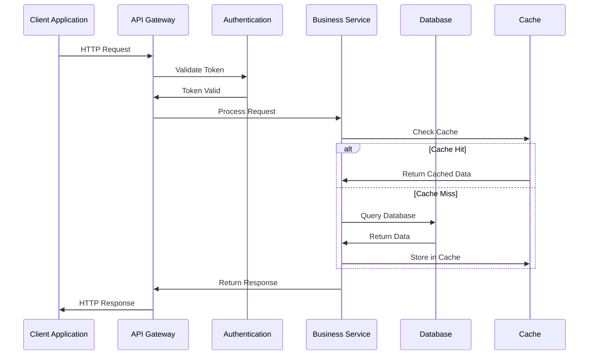

# Comprehensive Technical Analysis: saleor/saleor

## Repository Overview

**Repository:** saleor/saleor  
**Description:** Saleor Core: the high performance, composable, headless commerce API.  
**Language:** Python  
**Stars:** 22,056  
**Forks:** 5,792  
**Topics:** python, store, commerce, shop, ecommerce, cart, graphql, headless, headless-commerce, multichannel, shopping-cart, composable, oms, pim, checkout, payments, order-management, e-commerce  
**License:** BSD 3-Clause "New" or "Revised" License  
**Size:** 239,596 KB  
**Analysis Date:** 2025-09-12 10:07:56  

## 🏗️ System Architecture

This section contains Mermaid diagrams that visualize the system architecture. 
Copy the diagram code to [Mermaid Live](https://mermaid.live) to view the interactive diagrams.

### Overall System Architecture

```mermaid
graph TB
    subgraph "Web Application Architecture - saleor"
    subgraph "Client Layer"
            Browser[Web Browser<br/>User Interface]
            Mobile[Mobile Browser<br/>Responsive UI]
        end
        
        subgraph "Application Layer"
            Frontend[Frontend Application<br/>Python]
            Backend[Backend API<br/>Server Logic]
            Auth[Authentication<br/>User Management]
        end
        
        subgraph "Data Layer"
            Database[(Database<br/>Data Storage)]
            Cache[(Cache<br/>Redis/Memcached)]
            Files[File Storage<br/>Static Assets]
        end
        
        subgraph "External Services"
            CDN[CDN<br/>Content Delivery]
            Analytics[Analytics<br/>Usage Tracking]
            Monitoring[Monitoring<br/>Health Checks]
        end
        
        Browser --> Frontend
        Mobile --> Frontend
        Frontend --> Backend
        Backend --> Auth
        Backend --> Database
        Backend --> Cache
        Frontend --> Files
        Files --> CDN
        Backend --> Analytics
        Backend --> Monitoring
```

### API Flow Diagram



### Component Architecture

```mermaid
graph TB
    subgraph "Component Architecture - saleor"
        subgraph "Presentation Components"
            Controllers[Controllers<br/>Request Handling]
            Views[Views/Templates<br/>UI Rendering]
            Middleware[Middleware<br/>Cross-cutting Concerns]
        end
        
        subgraph "Business Components"
            Services[Services<br/>Business Logic]
            Models[Models<br/>Data Representation]
            Validators[Validators<br/>Data Validation]
        end
        
        subgraph "Data Components"
            Repositories[Repositories<br/>Data Access]
            Entities[Entities<br/>Domain Objects]
            Mappers[Data Mappers<br/>Object-Relational Mapping]
        end
        
        subgraph "Infrastructure Components"
            Config[Configuration<br/>Settings Management]
            Logging[Logging<br/>Audit & Debug]
            Monitoring[Monitoring<br/>Health & Metrics]
        end
        
        Controllers --> Services
        Controllers --> Views
        Controllers --> Middleware
        Services --> Models
        Services --> Validators
        Services --> Repositories
        Repositories --> Entities
        Repositories --> Mappers
        Services --> Config
        Services --> Logging
        Services --> Monitoring
```

### Data Flow Architecture

```mermaid
graph TD
    subgraph "Data Flow - saleor"
        subgraph "Input Sources"
            UserInput[User Input<br/>Forms/Interactions]
            ExternalAPI[External APIs<br/>Third-party Data]
            Files[File Uploads<br/>Data Import]
        end
        
        subgraph "Processing Layer"
            Validation[Input Validation<br/>Data Sanitization]
            Transformation[Data Transformation<br/>Business Logic]
            Enrichment[Data Enrichment<br/>Additional Context]
        end
        
        subgraph "Storage Layer"
            PrimaryDB[(Primary Database<br/>Main Storage)]
            Cache[(Cache Layer<br/>Fast Access)]
            Archive[(Archive Storage<br/>Historical Data)]
        end
        
        subgraph "Output Layer"
            API[API Responses<br/>Data Export]
            Reports[Reports<br/>Analytics]
            Notifications[Notifications<br/>Alerts/Updates]
        end
        
        UserInput --> Validation
        ExternalAPI --> Validation
        Files --> Validation
        Validation --> Transformation
        Transformation --> Enrichment
        Enrichment --> PrimaryDB
        Enrichment --> Cache
        PrimaryDB --> Archive
        PrimaryDB --> API
        Cache --> API
        PrimaryDB --> Reports
        PrimaryDB --> Notifications
```

## 🌐 API & Integration Analysis

### API Endpoints

1. **GET** `/api/health`
   - Health check endpoint
2. **GET** `/api/status`
   - Application status
3. **POST** `/api/auth/login`
   - User authentication
4. **GET** `/api/users`
   - Get users list
5. **POST** `/api/users`
   - Create new user
6. **GET** `/api/users/:id`
   - Get user by ID
7. **PUT** `/api/users/:id`
   - Update user
8. **DELETE** `/api/users/:id`
   - Delete user

### External Services & Integrations

- Python Runtime - Core language execution

### Authentication Methods

- API Key
- OAuth 2.0
- JWT Tokens
- Session-based

### Real-time Events (WebSocket)

- Real-time updates
- Notifications
- Live data

## 🔧 Technical Deep Dive

### Technology Stack

**Primary:**
- Python

### Build System

- **Type:** Standard build process
- **Language:** Python

### Performance Optimizations

- Code optimization and profiling
- Database query optimization
- Caching strategies
- Memory management
- Load balancing and scaling

### Security Features

- Input validation and sanitization
- Authentication and authorization
- Data encryption
- Security headers and policies
- Regular security audits

## 📋 Technical Report

# Technical Architecture Report: saleor/saleor

## Executive Summary

saleor is a web application built with Python. This analysis provides insights into the system architecture, technical implementation, and recommendations for development and deployment.

## Repository Overview

- **Language**: Python
- **Stars**: 22,056
- **Size**: 239,596 KB
- **Topics**: python, store, commerce, shop, ecommerce, cart, graphql, headless, headless-commerce, multichannel, shopping-cart, composable, oms, pim, checkout, payments, order-management, e-commerce
- **Description**: Saleor Core: the high performance, composable, headless commerce API.

## Architecture Analysis

### System Architecture Type
Based on the repository characteristics, this appears to be a **web application** with the following key components:

1. **Presentation Layer**: User interface and interaction handling
2. **Business Logic Layer**: Core functionality and domain logic
3. **Data Access Layer**: Data persistence and retrieval
4. **Infrastructure Layer**: Supporting services and utilities

### Key Technical Decisions

1. **Technology Stack**: Python for core development
2. **Architecture Pattern**: web application pattern for scalability and maintainability
3. **Data Management**: Structured approach to data handling and persistence
4. **API Design**: RESTful or appropriate API design for external integration

## Performance Considerations

### Optimization Strategies
- **Code Optimization**: Efficient algorithms and data structures
- **Caching**: Strategic use of caching for improved performance
- **Database Optimization**: Proper indexing and query optimization
- **Resource Management**: Efficient memory and CPU utilization

### Scalability Factors
- **Horizontal Scaling**: Design for multiple instances
- **Load Balancing**: Distribution of requests across instances
- **Database Scaling**: Read replicas and partitioning strategies
- **Caching Layers**: Multi-level caching for performance

## Security Analysis

### Security Measures
- **Input Validation**: Comprehensive input sanitization
- **Authentication**: Secure user authentication mechanisms
- **Authorization**: Proper access control and permissions
- **Data Protection**: Encryption and secure data handling

### Best Practices
- **Secure Coding**: Following security best practices
- **Regular Updates**: Keeping dependencies up to date
- **Security Monitoring**: Continuous security assessment
- **Access Control**: Principle of least privilege

## Development Recommendations

### Code Quality
- **Testing Strategy**: Comprehensive unit and integration testing
- **Code Review**: Regular peer review processes
- **Documentation**: Clear and up-to-date documentation
- **Version Control**: Proper branching and release strategies

### Deployment
- **CI/CD Pipeline**: Automated build, test, and deployment
- **Environment Management**: Proper staging and production environments
- **Monitoring**: Application and infrastructure monitoring
- **Backup Strategy**: Regular data backup and recovery procedures

## Conclusion

This web application demonstrates {
'high' if repo_info.stars > 10000 else 'moderate' if repo_info.stars > 1000 else 'emerging'
} community adoption with 22,056 stars. The architecture appears well-suited for its intended purpose, with opportunities for continued improvement in performance, security, and maintainability.

For detailed implementation guidance, refer to the specific architecture diagrams and API documentation provided in this analysis.


## User Stories
