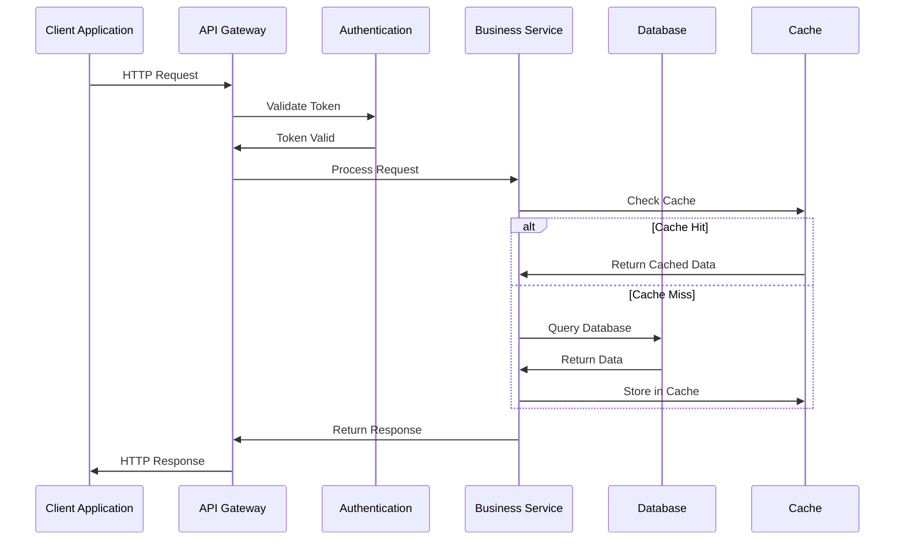

```mermaid
sequenceDiagram
    participant Client as Client Application
    participant API as API Gateway
    participant Auth as Authentication
    participant Service as Business Service
    participant DB as Database
    participant Cache as Cache

    Client->>API: HTTP Request
    API->>Auth: Validate Token
    Auth->>API: Token Valid
    API->>Service: Process Request
    Service->>Cache: Check Cache
    alt Cache Hit
        Cache->>Service: Return Cached Data
    else Cache Miss
        Service->>DB: Query Database
        DB->>Service: Return Data
        Service->>Cache: Store in Cache
    end
    Service->>API: Return Response
    API->>Client: HTTP Response
```