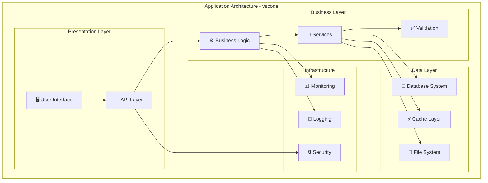
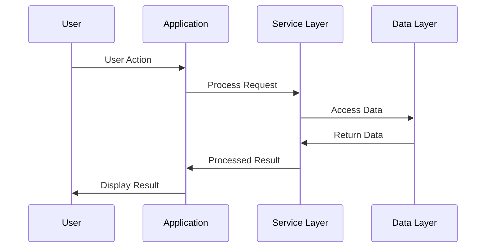
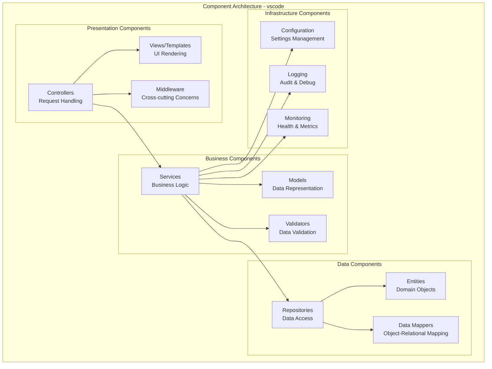
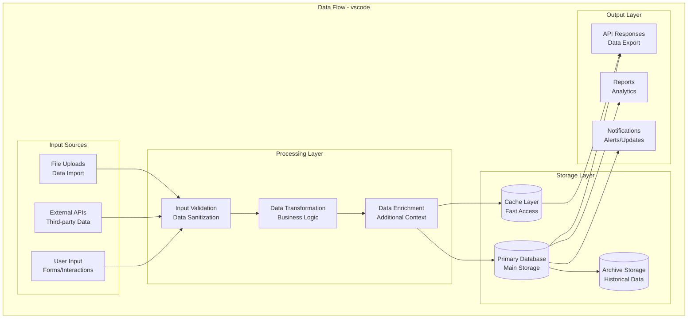

# Comprehensive Technical Analysis: microsoft/vscode

## Repository Overview

**Repository:** microsoft/vscode  
**Description:** Visual Studio Code  
**Language:** TypeScript  
**Stars:** 176,658  
**Forks:** 34,958  
**Topics:** editor, electron, visual-studio-code, typescript, microsoft  
**License:** MIT License  
**Size:** 1,064,252 KB  
**Analysis Date:** 2025-09-13 19:24:07  

## 🏗️ System Architecture

This section contains Mermaid diagrams that visualize the system architecture. 
Copy the diagram code to [Mermaid Live](https://mermaid.live) to view the interactive diagrams.

### Overall System Architecture

### API Flow Diagram

### Component Architecture

### Data Flow Architecture

## 🌐 API & Integration Analysis

### API Endpoints

1. **GET** `/api/status`
   - Service status
2. **POST** `/api/process`
   - Main processing endpoint
3. **GET** `/api/data`
   - Data retrieval
4. **POST** `/api/data`
   - Data submission

### External Services & Integrations

- TypeScript Runtime - Core language execution

### Authentication Methods

- API Key
- OAuth 2.0
- JWT Tokens
- Session-based

### Real-time Events (WebSocket)

- Real-time updates
- Notifications
- Live data

## 🔧 Technical Deep Dive

### Technology Stack

**Primary:**
- TypeScript

### Build System

- **Type:** Standard build process
- **Language:** TypeScript

### Performance Optimizations

- Code optimization and profiling
- Database query optimization
- Caching strategies
- Memory management
- Load balancing and scaling

### Security Features

- Input validation and sanitization
- Authentication and authorization
- Data encryption
- Security headers and policies
- Regular security audits

## 📋 Technical Report

# Technical Architecture Report: microsoft/vscode

## Executive Summary

vscode is a desktop application built with TypeScript. This analysis provides insights into the system architecture, technical implementation, and recommendations for development and deployment.

## Repository Overview

- **Language**: TypeScript
- **Stars**: 176,658
- **Size**: 1,064,252 KB
- **Topics**: editor, electron, visual-studio-code, typescript, microsoft
- **Description**: Visual Studio Code

## Architecture Analysis

### System Architecture Type
Based on the repository characteristics, this appears to be a **desktop application** with the following key components:

1. **Presentation Layer**: User interface and interaction handling
2. **Business Logic Layer**: Core functionality and domain logic
3. **Data Access Layer**: Data persistence and retrieval
4. **Infrastructure Layer**: Supporting services and utilities

### Key Technical Decisions

1. **Technology Stack**: TypeScript for core development
2. **Architecture Pattern**: desktop application pattern for scalability and maintainability
3. **Data Management**: Structured approach to data handling and persistence
4. **API Design**: RESTful or appropriate API design for external integration

## Performance Considerations

### Optimization Strategies
- **Code Optimization**: Efficient algorithms and data structures
- **Caching**: Strategic use of caching for improved performance
- **Database Optimization**: Proper indexing and query optimization
- **Resource Management**: Efficient memory and CPU utilization

### Scalability Factors
- **Horizontal Scaling**: Design for multiple instances
- **Load Balancing**: Distribution of requests across instances
- **Database Scaling**: Read replicas and partitioning strategies
- **Caching Layers**: Multi-level caching for performance

## Security Analysis

### Security Measures
- **Input Validation**: Comprehensive input sanitization
- **Authentication**: Secure user authentication mechanisms
- **Authorization**: Proper access control and permissions
- **Data Protection**: Encryption and secure data handling

### Best Practices
- **Secure Coding**: Following security best practices
- **Regular Updates**: Keeping dependencies up to date
- **Security Monitoring**: Continuous security assessment
- **Access Control**: Principle of least privilege

## Development Recommendations

### Code Quality
- **Testing Strategy**: Comprehensive unit and integration testing
- **Code Review**: Regular peer review processes
- **Documentation**: Clear and up-to-date documentation
- **Version Control**: Proper branching and release strategies

### Deployment
- **CI/CD Pipeline**: Automated build, test, and deployment
- **Environment Management**: Proper staging and production environments
- **Monitoring**: Application and infrastructure monitoring
- **Backup Strategy**: Regular data backup and recovery procedures

## Conclusion

This desktop application demonstrates {
'high' if repo_info.stars > 10000 else 'moderate' if repo_info.stars > 1000 else 'emerging'
} community adoption with 176,658 stars. The architecture appears well-suited for its intended purpose, with opportunities for continued improvement in performance, security, and maintainability.

For detailed implementation guidance, refer to the specific architecture diagrams and API documentation provided in this analysis.

## User Stories
